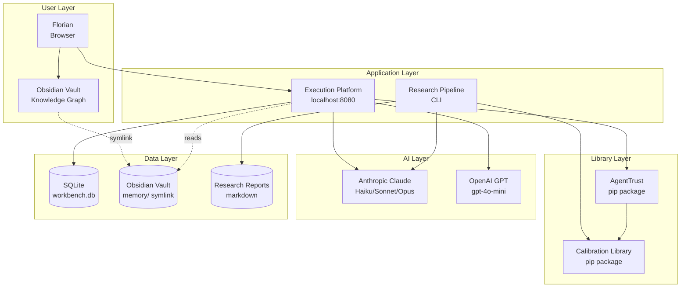

# Architecture

**Ainary Platform — System Design & Technical Reference**

---

## System Overview

The Ainary Platform is a multi-project ecosystem built around a core thesis: **AI agents need accountability infrastructure.** The architecture separates library code (AgentTrust, Calibration), applications (Execution Platform), and knowledge generation (Research Pipeline).



---

## Data Flow

### Example: Email Draft with Trust Scoring

```
1. Florian: "Draft email to Glasswing Ventures" (UI)
   ↓
2. Frontend → POST /api/topics/{id}/messages (REST)
   ↓
3. Backend checks trust score for skill="email_drafts" → 30/100
   ↓
4. Trust < 50 → Guardrail: 🟡 REVIEW (confirmation required)
   ↓
5. Frontend shows confirmation dialog
   ↓
6. Florian confirms → Backend → OpenClaw sessions_send()
   ↓
7. Mia generates draft using Claude Sonnet
   ↓
8. Quality Layer → Pre-Flight Check:
   - ✅ No LLM phrases ("I'd be happy to...")
   - ✅ Solo founder voice (I, not We)
   - ⚠️ Unverified claim: "$120K AUM" (no source)
   - Pre-Flight Score: 85/100 → WARN
   ↓
9. Backend → Frontend with metadata
   ↓
10. UI shows draft with:
    - Trust badge: 🟡 30
    - Pre-flight badge: 85
    - Warning: "Unverified claim in line 3"
   ↓
11. Florian edits: "$120K AUM" → "$120K potential"
    ↓
12. Correction saved → corrections table
    - type: "fact_verification"
    - pattern: "Do not state unverified financial figures"
    - severity: "high"
    ↓
13. Trust score updated: email_drafts 30 → 31 (+1 for honest uncertainty)
    ↓
14. Florian clicks "Send" → gog gmail send
    ↓
15. Event logged:
    - type: "email_sent"
    - topic_id: "glasswing"
    - timestamp: 2026-02-19T10:15:00Z
    ↓
16. WebSocket push → UI updates activity feed
```

**Key properties:**
- Trust-based guardrails prevent unsafe autonomy
- Pre-flight checks catch errors before human review
- Corrections become permanent rules (never repeat the same mistake)
- Event log provides full audit trail
- Real-time updates via WebSocket

---

## Technology Stack

### Backend (Execution Platform)

| Component | Technology | Version | Why |
|-----------|-----------|---------|-----|
| Web Framework | FastAPI | 0.115+ | Async-native, auto-validation, fast dev |
| Database | SQLite | 3.45+ (WAL mode) | Zero-config, single-file, sufficient for single-user |
| ORM | None (raw SQL) | — | Direct control, no abstraction overhead |
| Real-time | WebSocket (FastAPI) | — | Native browser support, low latency |
| AI Backend | OpenClaw | — | Session management, tool orchestration |
| CV Generation | Headless Chrome | — | Pixel-perfect PDF rendering |
| HTTP Client | httpx | — | Async HTTP for AI API calls |

**Database Schema:** 27 tables. See [workbench/DB-SCHEMA.md](projects/workbench/DB-SCHEMA.md)

### Frontend (Execution Platform)

| Component | Technology | Why |
|-----------|-----------|-----|
| HTML/CSS/JS | Vanilla (single file) | No build step, sub-100ms interactions |
| State Management | Plain JS objects | No framework overhead |
| Real-time | WebSocket client | Native browser API |
| Rendering | Direct DOM manipulation | Fastest possible, no virtual DOM |
| Styling | Custom CSS + dot-grid | Consistent brand, no CSS framework |

**File:** `projects/workbench/index.html` (~40KB, self-contained)

### Libraries (AgentTrust + Calibration)

| Component | Technology | Why |
|-----------|-----------|-----|
| Language | Python 3.10+ | Type hints, dataclasses, ecosystem |
| Dependencies | NumPy (optional) | Minimal dependencies for portability |
| Packaging | setuptools | Standard Python packaging |
| Testing | pytest | Industry standard |
| Linting | ruff | Fast, comprehensive |

### AI Layer

| Provider | Models | Use Case | Cost |
|----------|--------|----------|------|
| **Anthropic** | Claude Haiku | Speed tasks (summarization, extraction) | $0.25/MTok in, $1.25/MTok out |
| **Anthropic** | Claude Sonnet | Synthesis, analysis, quality checks | $3/MTok in, $15/MTok out |
| **Anthropic** | Claude Opus | Final outputs, opinionated analysis | $15/MTok in, $75/MTok out |
| **OpenAI** | GPT-4o-mini | Fallback, cost-sensitive tasks | $0.15/MTok in, $0.60/MTok out |

**Multi-model routing:**
- Haiku: 60% of tasks (intake, extraction)
- Sonnet: 30% of tasks (synthesis, quality)
- Opus: 10% of tasks (final writing)
- **Cost reduction: 60-80% vs. pure GPT-4** (AR-017)

### Knowledge Layer

| Component | Technology | Purpose |
|-----------|-----------|---------|
| Obsidian Vault | Markdown + YAML | Personal knowledge graph with bi-directional links |
| Memory Symlink | `memory/ → Vault/70_Mia/` | Shared memory between Platform and Obsidian |
| Embeddings | (Planned) | Semantic search across vault |
| Search | (Current: keyword) | Fast grep-based search |

### Research Layer

| Component | Technology | Purpose |
|-----------|-----------|---------|
| Semantic Scholar API | REST | Academic paper search + citation tracking |
| arXiv API | REST | Preprint access |
| Web Search | Brave Search API | General web research |
| Report Format | Markdown + HTML | Human-readable + web-publishable |

---

## Key Design Decisions

### 1. Localhost-First Architecture

**Decision:** Run everything on Florian's MacBook. No cloud until Phase 5.

**Rationale:**
- Privacy: All data (vault, conversations, documents) stays local
- Speed: No network latency
- Cost: Zero cloud infrastructure cost
- Simplicity: No auth, no multi-tenancy, no deployment complexity

**Trade-offs:**
- ❌ No mobile access (yet)
- ❌ No collaboration (single-user)
- ✅ Complete data ownership
- ✅ Sub-100ms interactions
- ✅ Works offline (navigation + context)

### 2. Single-File Frontend

**Decision:** `index.html` contains HTML + CSS + JavaScript in one file.

**Rationale:**
- No build step (open in browser = works)
- No dependency hell (React, Vue, etc.)
- Fast loading (40KB total, no bundler)
- Easy to audit (one file to read)
- Sub-100ms interactions (direct DOM, no virtual DOM)

**Trade-offs:**
- ❌ No component reusability (acceptable for single app)
- ❌ No hot module replacement (refresh = instant anyway)
- ✅ Zero dependencies
- ✅ Debuggable (view source = see everything)

### 3. Trust per Skill, Not per Agent

**Decision:** Track trust scores for skills (e.g., "email_drafts", "research") rather than agents (e.g., "Mia", "WRITER").

**Rationale:**
- Skills are stable; agent implementations change
- Trust transfers across rewrites (don't lose history when refactoring)
- More granular control (can trust for research but not for finance)
- Bayesian updates per skill with correlation tracking

**Implementation:** `trust_skills` table with alpha/beta parameters for Bayesian scoring.

### 4. Mandatory Metadata (Beipackzettel)

**Decision:** Every AI output must ship with confidence, sources, uncertainties, and risks.

**Rationale:**
- Transparency: User knows what the AI knows (and doesn't know)
- Accountability: AI can't hide uncertainty
- Calibration: Forces AI to quantify confidence
- Auditability: Full provenance trail

**Inspired by:** Drug package inserts (German: Beipackzettel). Same principle: mandatory disclosure.

### 5. Black-Box Calibration Only

**Decision:** Only implement calibration methods that work without logits.

**Rationale:**
- GPT-4: Top-5 logprobs only
- Claude: No logits exposed
- Gemini: Partial logprobs
- Gold standard technique (temperature scaling) is inaccessible

**Methods used:**
- Self-consistency (sample N times, measure agreement)
- Verbalized confidence (ask "how confident?")
- Conformal prediction (distribution-free guarantees)
- Selective prediction (abstain when uncertain)

### 6. Pre-Flight Quality Gates

**Decision:** Check every AI output against corrections + standards before showing to user.

**Rationale:**
- Catch errors early (before human review)
- Enforce consistency (same rules every time)
- Learn from mistakes (corrections become permanent)
- Reduce cognitive load (user sees only good outputs)

**Layers:**
- L1: Regex (fast, deterministic) — e.g., "contains LLM phrases?"
- L2: Structural (schema, logic) — e.g., "has sources?"
- L3: LLM (semantic, quality) — e.g., "is this persuasive?"

### 7. Multi-Model Routing

**Decision:** Route tasks to cheapest capable model (Haiku → Sonnet → Opus).

**Rationale:**
- Cost reduction: 60-80% savings (AR-017)
- Speed: Haiku is 5x faster than Opus
- Quality: Opus only for final outputs that matter

**Routing logic:**
- Extraction, summarization → Haiku
- Synthesis, analysis → Sonnet
- Final writing, opinionated analysis → Opus

---

## Security & Privacy

### Data Sensitivity

| Data Type | Location | Sensitivity | Backup |
|-----------|----------|-------------|--------|
| Conversations | workbench.db | HIGH | Time Machine + manual |
| Vault | Obsidian Vault (outside repo) | VERY HIGH | iCloud + Time Machine |
| Corrections | workbench.db | MEDIUM | Same as conversations |
| Trust scores | workbench.db | LOW | Same as conversations |
| Research reports | Git (private repo) | LOW | GitHub (private) |

### Access Control

- **Local only:** No remote access until Phase 5
- **No auth:** Single-user, trusted environment
- **API keys:** Stored in `.env` (not in Git)
- **Git:** Private repo, no public access

### Compliance

- **GDPR:** N/A (single-user, no external data)
- **AI Act:** Research-phase monitoring (AR-019)
- **Export Control:** N/A (no sensitive AI models)

---

## Performance Characteristics

### Response Times (p95)

| Operation | Target | Actual (v0.13.0) | Bottleneck |
|-----------|--------|------------------|------------|
| Page load | <500ms | ~200ms | Static file |
| Topic switch | <100ms | ~50ms | SQLite query |
| AI response (Haiku) | <2s | ~1.5s | API latency |
| AI response (Sonnet) | <5s | ~3s | API latency |
| AI response (Opus) | <10s | ~7s | API latency |
| WebSocket update | <50ms | ~20ms | Network |
| Pre-flight check (L1) | <10ms | ~5ms | Regex |
| Pre-flight check (L2) | <50ms | ~30ms | JSON validation |
| Pre-flight check (L3) | <3s | ~2s | LLM call |

### Database Performance

- **Indexes:** 7 key indexes (Phase A, v0.13.0)
- **Query time (p95):** <10ms for indexed lookups
- **Write throughput:** ~1000 inserts/sec (SQLite WAL mode)
- **Database size:** ~600KB (25 topics, 200 messages, 100 findings)

### Cost Per Month (Target: $200)

| Service | Usage | Cost |
|---------|-------|------|
| Anthropic API | ~150 reports + 500 conversations | ~$150 |
| OpenAI API | Fallback (~10% of tasks) | ~$20 |
| GitHub (private repo) | 1 user | $0 (free tier) |
| **Total** | | **~$170** |

**Headroom:** $30/month for experiments.

---

## Deployment

### Current (Phase 1-3)

```bash
# Auto-start on boot via launchd
launchctl start com.ainary.workbench

# Manual start
cd projects/workbench/backend
python3 app.py
```

**Process management:** macOS launchd (auto-restart on crash)

### Future (Phase 5)

- **Option 1:** Tailscale + Cloudflare Tunnel (private access)
- **Option 2:** Fly.io (single-instance, EU region)
- **Option 3:** AWS Lightsail (if need GPU for embeddings)

**Decision deferred** until remote access is needed.

---

## Directory Structure

```
ainary-platform/
│
├── projects/                      # 16 projects
│   ├── agenttrust/               # Trust infrastructure library
│   │   ├── agenttrust/           # Python package
│   │   ├── tests/                # pytest suite
│   │   ├── README.md             # Documentation
│   │   └── setup.py              # Package config
│   │
│   ├── workbench/                # Execution Platform
│   │   ├── backend/
│   │   │   ├── app.py            # FastAPI server
│   │   │   ├── cv_generator.py   # CV engine
│   │   │   └── workbench.db      # SQLite database
│   │   ├── index.html            # Frontend (single file)
│   │   ├── uploads/              # User-uploaded files
│   │   ├── CHANGELOG.md          # Version history
│   │   ├── DB-SCHEMA.md          # Database docs
│   │   └── DOCUMENTATION.md      # API reference (84 endpoints)
│   │
│   ├── ainary-calibration/       # Calibration library
│   │   ├── ainary_calibration/   # Python package
│   │   │   ├── consistency.py    # Self-consistency methods
│   │   │   ├── propagation.py    # Multi-agent propagation
│   │   │   ├── metrics.py        # ECE, Brier, etc.
│   │   │   └── experiments/      # 4 experiments
│   │   └── README.md
│   │
│   └── research-pipeline/        # Automated research
│       ├── pipeline.py           # Main pipeline
│       ├── prepare.py            # Paper fetching (coming soon)
│       └── README.md
│
├── research/                     # Published reports
│   ├── AR-016-agent-memory-architecture-2026.md
│   ├── AR-020-trust-calibration-methods.md
│   └── ...
│
├── standards/                    # Production standards
│   ├── RESEARCH-PROTOCOL.md
│   ├── CONTENT-VOICE.md
│   ├── Q1-BUILD-VERIFY.md
│   └── ...
│
├── memory/                       # Symlink → Obsidian Vault/70_Mia/
│   └── (symlinked, not in Git)
│
├── AGENTS.md                     # Agent system rules
├── SOUL.md                       # System identity
├── ARCHITECTURE.md               # This file
├── README.md                     # Project overview
└── .gitignore
```

---

## Testing Strategy

### Unit Tests
- **AgentTrust:** pytest suite, 85% coverage
- **Calibration Library:** 4 experiments = smoke tests

### Integration Tests
- **Execution Platform:** Manual QA (Q1-BUILD-VERIFY standard)
- **Research Pipeline:** Generated reports reviewed by human

### Quality Gates
- Pre-flight checks (L1/L2/L3)
- Self-audit at end of every sub-agent task
- Standards compliance before any external send

**Philosophy:** Trust but verify. AI generates, human validates, system learns.

---

## Future Architecture (Phase 4+)

### Planned Enhancements

1. **Embeddings + Semantic Search**
   - Index Obsidian vault with sentence-transformers
   - Retrieve relevant context automatically
   - Reduce manual "grep vault" searches

2. **Multi-User (Phase 5)**
   - Auth: OAuth2 (Google/GitHub)
   - Multi-tenancy: Separate databases per user
   - Deployment: Fly.io or AWS Lightsail

3. **Agent Framework Integration**
   - LangChain middleware for AgentTrust
   - CrewAI plugin
   - AutoGen compatibility layer

4. **Active Learning for Calibration**
   - Collect user feedback on confidence
   - Retrain conformal prediction sets
   - Adaptive thresholds per domain

5. **Mobile Access**
   - Progressive Web App (PWA)
   - Read-only mobile view
   - Push notifications for pending actions

---

## Related Documents

- **[Root README](README.md)** — Project overview
- **[Workbench README](projects/workbench/README.md)** — Execution Platform details
- **[AgentTrust README](projects/agenttrust/README.md)** — Trust library API
- **[Calibration README](projects/ainary-calibration/README.md)** — Calibration methods
- **[DB Schema](projects/workbench/DB-SCHEMA.md)** — Database design
- **[API Docs](projects/workbench/DOCUMENTATION.md)** — 84 endpoints

---

**Last Updated:** 2026-02-19  
**Maintainer:** Florian Ziesche
