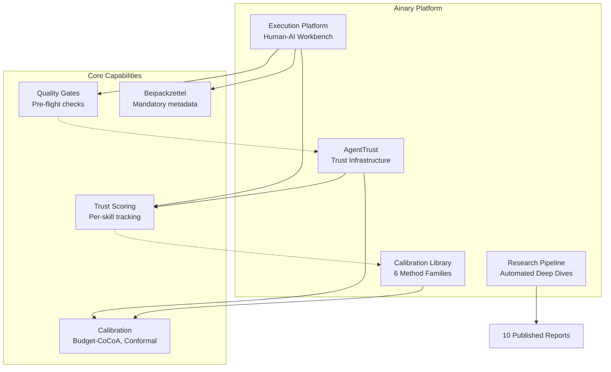

# Ainary Platform

**AI-powered execution infrastructure for trust-calibrated agent systems.**

[](LICENSE)
[](https://python.org)
[]()

---

## What is Ainary?

Ainary builds infrastructure that makes AI agents trustworthy. Not by limiting them — by measuring, calibrating, and verifying their confidence.

**The Problem:** LLMs are overconfident 84% of the time. When an AI agent says "I'm 95% confident," it's usually wrong about how right it is. Every agent framework lets you build agents. None of them help you trust them.

**The Solution:** Three products, one thesis: **AI agents need accountability infrastructure.**

| Product | What it does | Why it matters |
|---------|-------------|----------------|
| **AgentTrust** | Trust calibration library for any agent framework | Calibration, trust scoring, mandatory metadata. Make confidence signals honest. |
| **Execution Platform** | Human-AI collaboration interface with trust scoring | The workbench where humans and agents collaborate with transparency, feedback loops, and quality gates. |
| **Calibration Library** | Python implementation of 6 calibration method families | State-of-the-art calibration techniques from 20+ papers (ICML, NeurIPS, ICLR). Black-box LLM compatible. |

**Built on Research:** 10+ deep-dive research reports covering AI trust, governance, calibration, agent memory, multi-agent coordination, and observability.

---

## Architecture



**How they fit together:**
- **AgentTrust** = Library. Plug it into any agent framework (LangChain, CrewAI, AutoGen, raw LLM).
- **Execution Platform** = Application. Uses AgentTrust to manage human-AI collaboration with trust scoring and quality gates.
- **Calibration Library** = Research → Production. Implements state-of-the-art methods from academic papers.
- **Research Pipeline** = Knowledge Engine. Generates deep-dive reports to inform product development.

---

## Projects

| Project | Description | Status | Documentation |
|---------|-------------|--------|---------------|
| **[AgentTrust](projects/agenttrust/)** | Trust infrastructure for AI agents. Calibration, trust scores, Beipackzettel. | v0.1.0 ✅ | [→ README](projects/agenttrust/README.md) |
| **[Execution Platform](projects/workbench/)** | Human-AI collaboration workbench with trust scoring, quality gates, correction engine. | v0.13.0 ✅ | [→ README](projects/workbench/README.md) |
| **[Calibration Library](projects/ainary-calibration/)** | Python library: 6 calibration families, 4 experiments, Monte Carlo validation. | v0.1.0 ✅ | [→ README](projects/ainary-calibration/README.md) |
| **[Research Pipeline](projects/research-pipeline/)** | Automated research report generation with multi-model routing (Haiku/Sonnet/Opus). | v0.2.0 ✅ | [→ README](projects/research-pipeline/README.md) |

### Additional Projects

- **[AI Advisory Board](projects/ai-advisory-board/)** — Multi-agent advisory system with domain experts
- **[Platform Website](projects/platform-website/)** — Public-facing Ainary website
- **[Glashuette KI](projects/glashuette-ki/)** — Regional AI consulting deployment
- **[Freie Presse](projects/freie-presse/)** — Media partnership automation
- **[CNC Planner](projects/cnc-planner/)** — Manufacturing planning tool

[See projects/ directory for complete list]

---

## Research

**10 published research reports** on AI trust, governance, and calibration.

| ID | Title | Quality | Key Finding |
|----|-------|---------|-------------|
| AR-016 | Agent Memory Architecture | R1 | Hierarchical memory (MemGPT) outperforms flat RAG by 10-12% in long-context benchmarks |
| AR-017 | Cost of AI Agent Operations | R1 | Multi-model routing reduces costs by 60-80% vs. pure GPT-4 |
| AR-018 | Multi-Agent Coordination | R1 | Shared memory patterns enable 3x throughput vs. sequential chains |
| AR-019 | AI Governance (EU Enterprise) | R1 | Compliance burden: 40-60 hours/project for GDPR + AI Act |
| AR-020 | Trust Calibration Methods | R2 ⭐ | RLHF destroys calibration; consistency-based methods achieve 27% ECE vs. 42% verbal |
| AR-021 | Agent Observability Stack | R1 | LangSmith + Weights & Biases = production standard |
| AR-022 | AI in Municipal Government | R1 | Adoption limited by procurement processes, not technology |
| AR-023 | From Consulting to SaaS | R1 | Services-first strategy de-risks product development |
| AR-024 | Prompt Engineering at Scale | R1 | Version control + A/B testing mandatory for production prompts |
| AR-025 | Operator Advantage in VC | R1 | Operating experience correlates with fund performance in AI/infra deals |

**Methodology:**
- **R1** (Speed Batch): 10 sources, 2K words, 2-3 hours
- **R2** (Deep Dive): 20+ sources, 4K+ words, 5 hypotheses, quality gate 15/15

[→ Full research reports](research/)

---

## Quick Start

### Run the Execution Platform

```bash
# 1. Start the platform (auto-starts on boot via launchctl)
launchctl start com.ainary.workbench

# 2. Open in browser
open http://localhost:8080

# 3. Create a topic, upload documents, collaborate with AI
```

### Use AgentTrust in Your Code

```bash
pip install agenttrust
```

```python
from agenttrust import sample_consistency

# Wrap any LLM function
result = sample_consistency(my_llm, "What causes inflation?", n=3)

print(result.confidence_level)   # HIGH / MEDIUM / LOW
print(result.confidence_pct)     # 85.0
print(result.agreement_ratio)    # 1.0 (3/3 agreed)
```

### Run Calibration Experiments

```bash
cd projects/ainary-calibration
python3 -m ainary_calibration.experiments.run_experiments
python3 -m ainary_calibration.experiments.analysis
```

### Generate a Research Report

```bash
cd projects/research-pipeline
python3 pipeline.py --topic "Agent Memory Systems" --tier R2
```

---

## Standards

We maintain production-grade standards for all output types:

- **[Research Protocol](standards/RESEARCH-PROTOCOL.md)** — MECE, hypotheses, source verification
- **[Content Voice](standards/CONTENT-VOICE.md)** — Anti-LLM, human voice, no bullshit
- **[Build Verify](standards/Q1-BUILD-VERIFY.md)** — 7-step verification for every code change
- **[Development Intake](standards/Q2-DEVELOPMENT-INTAKE.md)** — WAS/WARUM/SCOPE before any build
- **[Website Design Guide](standards/WEBSITE-DESIGN-GUIDE.md)** — Brand, typography, layout
- **[Brand Guide](standards/BRAND.md)** — Visual identity, voice, positioning

[→ All standards](standards/)

---

## Technology Stack

| Layer | Technology | Why |
|-------|-----------|-----|
| **Backend** | FastAPI + SQLite | Simple, fast, single-user. Async-native. Zero-config database. |
| **Frontend** | Vanilla JS + CSS | No build step, no dependencies. Sub-100ms interactions. |
| **AI** | Anthropic Claude + OpenAI GPT | Multi-model routing. Haiku for speed, Opus for quality. |
| **Knowledge** | Obsidian Vault + Embeddings | Semantic search + bi-directional linking. Personal knowledge graph. |
| **Research** | Semantic Scholar + arXiv APIs | Academic paper collection. Citation tracking. |
| **Deployment** | Localhost (launchd) | Single-user, zero cloud overhead. Remote = Phase 5. |

---

## Key Design Decisions

| Decision | Rationale |
|----------|-----------|
| **Black-box calibration only** | Most production LLMs (GPT-4, Claude) don't expose logits. Temperature scaling is inaccessible. |
| **Single-user, localhost-first** | Zero cloud overhead. Privacy by default. Remote access in Phase 5. |
| **Trust per skill, not per agent** | Skills are more stable than agent implementations. Trust transfers across rewrites. |
| **Mandatory metadata (Beipackzettel)** | Every AI output ships with confidence, sources, uncertainties, risks. Like a nutrition label. |
| **Quality gates before delivery** | Pre-flight checks against 29 corrections + 18 standards. Catch errors before human review. |
| **Services-first for revenue** | Consulting validates product needs. Product scales without linear time cost. |

---

## Contributing

This repository is **private**. For internal collaboration:

1. Follow the [Development Intake Standard](standards/Q2-DEVELOPMENT-INTAKE.md) for any new build
2. Follow the [Build Verify Standard](standards/Q1-BUILD-VERIFY.md) for every code change
3. Update `CHANGELOG.md` in the relevant project directory
4. No commits to `main` without verification

---

## License

**Apache 2.0** — See [LICENSE](LICENSE)

Open for research, collaboration, and derivative work. Attribution required.

---

## Author

**Florian Ziesche**  
Founder, Ainary Ventures  
[GitHub](https://github.com/florianziesche) · [LinkedIn](https://linkedin.com/in/florianziesche) · [Website](https://ainaryventures.com)

*Built from the realization that we build agents but never ask: "should we trust this?"*

---

## Directory Structure

```
.
├── projects/               # 16 projects (see above)
│   ├── agenttrust/        # Trust infrastructure library
│   ├── workbench/         # Execution Platform (v0.13.0)
│   ├── ainary-calibration/ # Calibration methods library
│   └── research-pipeline/  # Automated research reports
│
├── research/              # 10 published research reports
│   ├── AR-016-agent-memory-architecture-2026.md
│   ├── AR-020-trust-calibration-methods.md
│   └── ...
│
├── standards/             # Production standards
│   ├── RESEARCH-PROTOCOL.md
│   ├── CONTENT-VOICE.md
│   ├── Q1-BUILD-VERIFY.md
│   └── ...
│
├── memory/                # Symlink → Obsidian Vault (private)
├── AGENTS.md              # Agent system rules
├── SOUL.md                # System identity
└── README.md              # You are here
```

---

**Status:** Active Development · Last Updated: 2026-02-19
