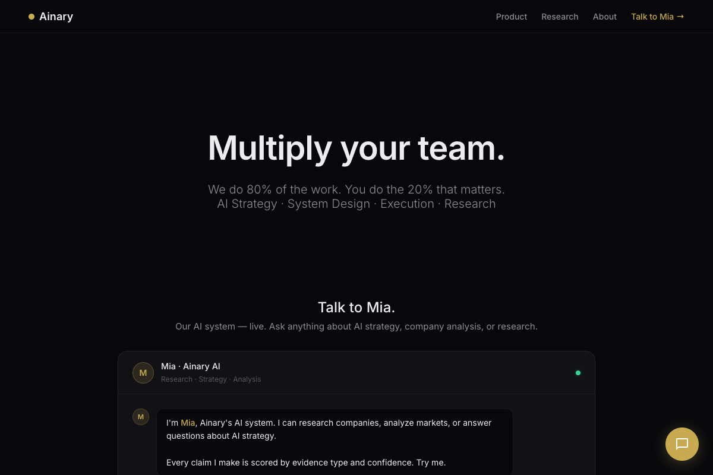
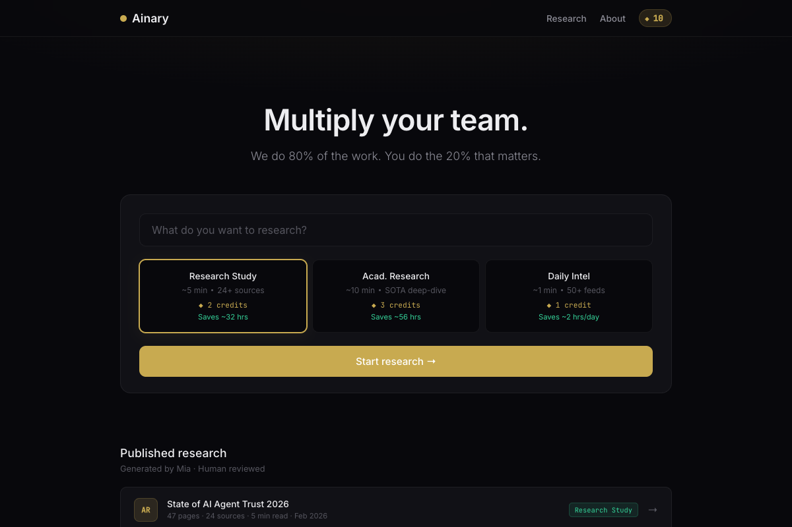
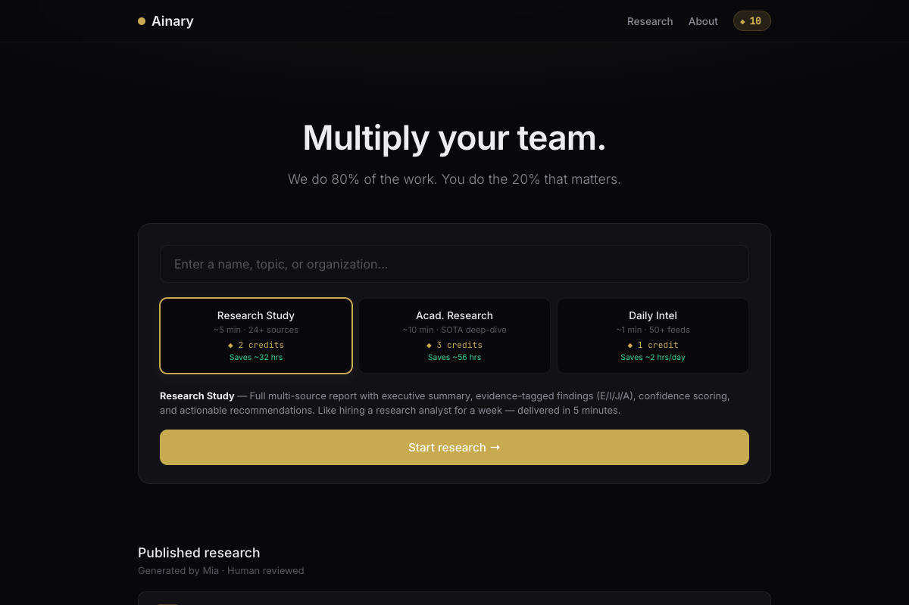
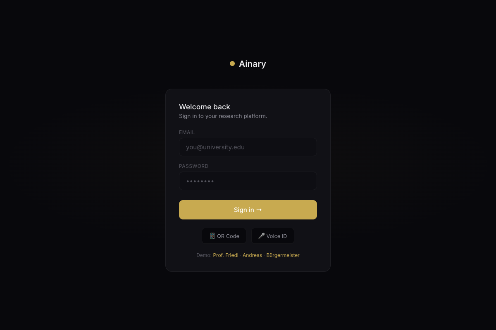
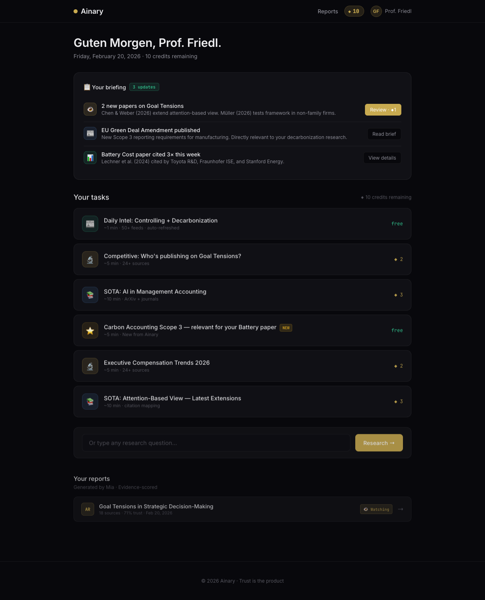
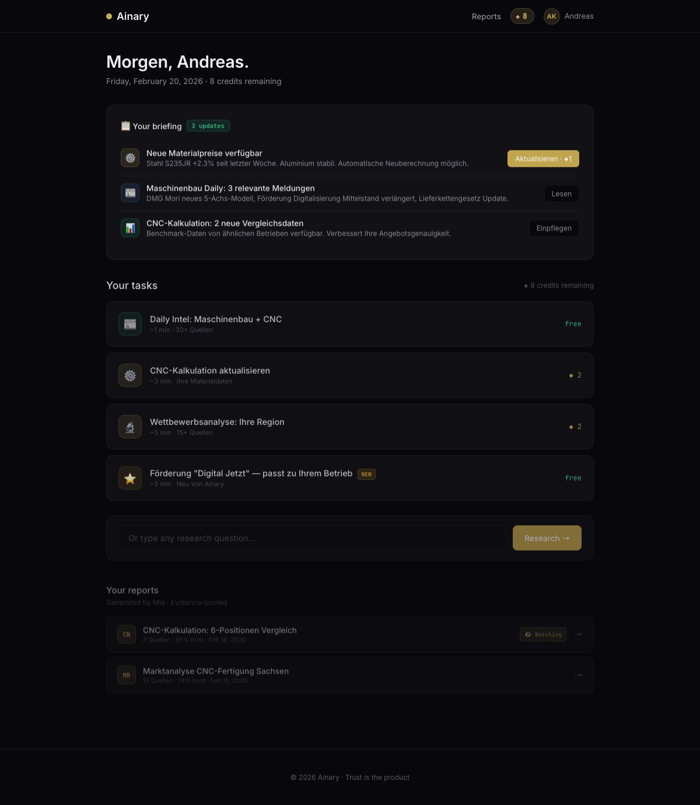
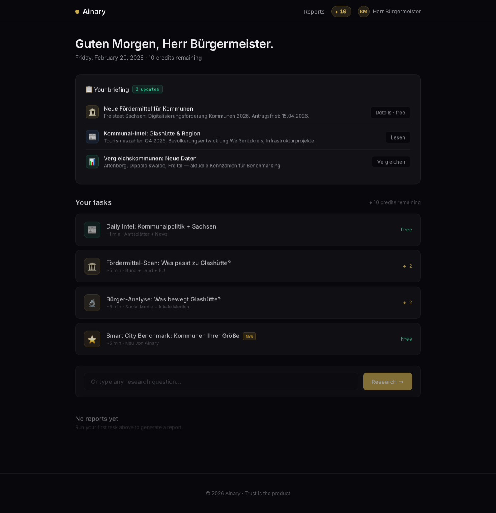

# Ainary Platform — Business Model & Product Documentation

**Version:** v4 → v5 (in progress)
**Date:** February 20, 2026
**Author:** Florian Ziesche + Mia

---

## 1. Vision

A personalized AI research platform where each user gets a tailored experience — from login briefing to curated research tasks. The platform serves as product, communication channel, CRM, and data pipeline in one.

**One-liner:** We do 80% of the work. You do the 20% that matters.

---

## 2. Business Model

### 2.1 Core Value Proposition

| For the user | For Ainary |
|---|---|
| 32–56 hrs saved per report | €1-3 production cost per report |
| 80% of research work eliminated | Usage data + domain-specific feedback |
| Daily intelligence without effort | Lock-in through workflow integration |
| Evidence-tagged, trust-scored output | Platform becomes indispensable |

### 2.2 Revenue Model: Credits

| Action | Credits | User Cost (est.) | Our Cost (est.) |
|---|---|---|---|
| **Free Pilot** | 1 free report | €0 | ~€2-3 |
| Research Study | ◆ 2 | ~€16 | ~€1.50 |
| Acad. Research (SOTA) | ◆ 3 | ~€24 | ~€2.50 |
| Daily Intel | ◆ 1 | ~€8 | ~€0.30 |
| Watch (setup) | free | €0 | ~€0.05/day |
| Watch (update) | ◆ 1 | ~€8 | ~€0.50 |

### 2.3 Pricing (simplified Feb 20, 2026)

**Kernprodukt: €99/Monat**
- Daily Intel inkl. (täglich, automatisch)
- Alle Reports lesbar
- Mia-Chat für Navigation, Projektanfragen, Uploads
- Cancel anytime

**Credits: 10 Stück = €49**
- Deep Dive Analysen: ◆2 pro Analyse
- Lieferung: 2 Werktage (intern: schneller liefern = Wow-Effekt)
- Update bestehender Analyse: ◆2

**Trial: 14 Tage kostenlos**
- Daily Intel + 1 Deep Dive + ◆5 Credits

**ROI-Kommunikation:**
- Nur als % angeben, nie als €-Betrag
- "ROI ~400%" statt "€1,800 gespart"
- "Recherche-Äquivalent: ~7 Std." statt "7 Std. gespart"
- Ehrlicher, weniger wie ein Versprechen

| Was | Preis | ROI (diskret) |
|---|---|---|
| Abo inkl. Daily Intel | €99/mo | ~400% |
| 10 Credits | €49 | pro Analyse ~250-500% |
| Einzelanalyse (◆2) | ~€9,80 | Äquiv. 12-32 Std. |

### 2.3.1 Trial-Zugang (14 Tage)

> **Regel:** Jeder neue User bekommt 14 Tage + 1 vollständigen Report kostenlos.

**Warum 14 Tage:**
- 7 Tage = zu kurz. Ein Bürgermeister schaut 2x/Woche rein. Bei 7 Tagen sieht er 2 Briefings.
- 30 Tage = zu lang. Kein Conversion-Druck. "Ich schau nächste Woche nochmal."
- 14 Tage = 4-5 Briefings + 1 Deep Dive. Genug um Wert zu erleben, kurz genug für Urgency.

**Was im Trial enthalten ist:**
1. Daily Intel (täglich, kostenlos)
2. 1 Deep Dive Report (z.B. Fördermittel-Scan)
3. ◆5 Credits für weitere Analysen
4. Kein RAG — das ist der Upgrade-Trigger

**Was NICHT enthalten ist:**
- Dokumenten-Upload (RAG) → Starter
- Watch-Feature → Professional
- Admin-kuratierte Tasks → Professional

**Trial endet automatisch nach 14 Tagen. Kein stilles Abo.**

### 2.3.2 Keine Geld-zurück-Garantie

> **Regel:** Cancel anytime. Keine Geld-zurück-Garantie.

**Begründung:**
- Kein Wettbewerber macht es (Claude, ChatGPT, Perplexity, Lovable — keiner)
- "Geld zurück" signalisiert: "Wir sind uns nicht sicher ob es funktioniert"
- "Cancel anytime" hat den gleichen psychologischen Effekt (geringes Risiko), ohne unsere Unit Economics zu gefährden
- Trial validiert den Wert bereits kostenlos — wer danach zahlt, hat den Nutzen gesehen

### 2.3.3 RAG als Pricing-Hebel

RAG (Retrieval-Augmented Generation) = User lädt eigene Dokumente hoch, Ainary verknüpft sie mit externer Recherche.

**Warum RAG der Moat ist:**
1. **Personalisierung:** ChatGPT kennt Glashütte nicht. Wir schon — weil der BM seine Protokolle hochgeladen hat.
2. **Lock-in:** Nach 3 Monaten liegen 200 Dokumente bei uns. Wechselkosten = hoch.
3. **Upsell:** 10 Docs (Starter) reichen um den Wert zu sehen, nicht um das volle Potenzial zu nutzen.
4. **Ethik:** Export-Funktion MUSS angeboten werden. Lock-in durch Wert, nicht durch Datengeiselnahme.

**RAG-Stufen:**

| Stufe | Docs | Features | Tier |
|---|---|---|---|
| **Kein RAG** | 0 | Nur externe Recherche | Trial |
| **RAG Light** | 10 Dokumente | Upload + Suche + Verknüpfung mit Intel | Starter €49 |
| **RAG Voll** | Unbegrenzt | + Auto-Verknüpfung + "Dein Haushalt sagt X → Fördermittel Y" | Professional €99 |
| **RAG Team** | Unbegrenzt + Shared | + Team-Zugang + Rechte-Management | Institution €499+ |

**Konkrete RAG Use Cases pro Pilot-User:**

| User | Dokumente | Killer-Feature |
|---|---|---|
| BM Glashütte | Gemeinderatsprotokolle, Haushalt, Bürgerbriefe | "Haushalt sagt €50k Digitalisierung → 3 passende Förderprogramme" |
| Prof. Friedl | Paper-Drafts, Vorlesungsnotizen, Gutachten | "Dein Draft widerspricht Chen 2025 auf S.14 — hier ist die Quelle" |
| Andreas | Kalkulationen, Materialpreise, Maschinendaten | "Deine Materialkosten liegen 12% über Marktschnitt — Alternative X" |

### 2.4 Unit Economics

- **CAC (Customer Acquisition Cost):** ~€3 (one free pilot report)
- **LTV (Lifetime Value):** €49-499/mo × 12mo = €588-5,988
- **LTV/CAC Ratio:** 196x-1,996x (absurdly good if retention holds)
- **Margin per report:** ~85-95%
- **Break-even:** 1 paying customer covers ~20 free pilots

### 2.5 The Free Trial Strategy

> **Rule:** 14 Tage + 1 Report + ◆5 Credits. Immer. Kein stilles Abo.

**Why:**
1. €3 CAC is cheaper than any ad
2. User sees REAL output, not promises
3. 80% expectation is set upfront — no overclaim risk
4. The Daily Intel + 1 Report is the sales pitch
5. Kein RAG im Trial → Upgrade-Trigger ("stell dir vor, mit deinen eigenen Dokumenten...")

**Trial endet nach 14 Tagen. Danach:**
- Alle Dokumente bleiben sichtbar (read-only)
- Neue Briefings/Analysen gesperrt
- Upgrade-CTA: "14 Tage vorbei. Ihr letztes Briefing hatte 3 Handlungsempfehlungen — weiter für €49/mo"

### 2.6 Data-for-Value Exchange

During pilot, the platform asks users for data through the same interface:
- "To refine this CNC calculation, I need your material costs. Upload here ↑"
- "Rate this finding: useful / not useful / partially useful"
- "Which section was most valuable?"

**This is not a cost — it's the product improving.** Each data point makes the next report better.

---

## 3. Platform Architecture

### 3.1 Multi-User, Multi-Use-Case

The platform adapts per user:

| User | Use Case | Features |
|---|---|---|
| Prof. Friedl | Academic research | SOTA papers, Goal Tension tracking, Daily Intel |
| Andreas | CNC Manufacturing | Cost calculations, competitor analysis, material research |
| Bürgermeister | Public sector | Policy research, funding opportunities, citizen analysis |

Each user sees only what's relevant. Florian (admin) can add custom tasks per user.

### 3.2 Platform = Communication Channel

No separate email, Zoom, or Slack. Everything happens inside the platform:
- Mia (AI) delivers briefings and reports
- Users request and receive through the same interface
- Data requests are embedded in the workflow
- Notifications for Watch updates

### 3.3 User Flow

```
1. Login (email / QR / voice / password)
         ↓
2. Briefing: "Good morning. Here's what's new:"
   - Watch updates (new papers found)
   - Daily Intel summary
   - Admin-curated suggestions
         ↓
3. Dashboard: Your Tasks
   - [free] Daily Intel
   - [◆2]  Research Study
   - [◆3]  SOTA Deep-Dive
   - [NEW · free] Admin-added: "Relevant for your Battery paper"
         ↓
4. Execute → Live agents → Report → KPIs
         ↓
5. Watch → Ongoing monitoring → Update notifications
```

---

## 4. Product Evolution

### v1 — Chat Widget (Feb 20, 2026 AM)
**File:** `demo-v1-chat.html`



First prototype. Embedded chat interface with Mia on the Ainary website. Two options: inline chat or floating widget. Proof of concept for AI interaction on the site.

**Key elements:**
- Chat messages with evidence tags (E/I/J/A)
- Confidence scoring on responses
- Quick action buttons
- Floating chat widget (bottom-right)

**Limitation:** Generic chat, no personalization, no task structure.

---

### v2 — Credits & Task Cards (Feb 20, 2026 AM)
**File:** `demo-v2-credits.html`


Added credit system and structured task types. Three task cards with costs, time estimates, and time-saved KPIs.

**Key elements:**
- 10 free credits (visual dots)
- 3 task types: Research Study (◆2), Acad. Research (◆3), Daily Intel (◆1)
- Organization input → personalized use cases (TUM, BMW, McKinsey)
- Execution animation with agent logs
- KPI dashboard: Time saved, Trust score, Your 20%
- Competitive advantage framing
- Evidence-backed claims (Nature 2025, Elsevier)

**Limitation:** Too many sections, scrolling marathon, no real output.

---

### v3 — Simplified Single Container (Feb 20, 2026 AM)
**File:** `demo-v3-simplified.html`



Radical simplification. Everything in one container — no scrolling between sections.

**Key elements:**
- Topic input (not org input) → more natural
- 3 task tabs in one row
- Execution, KPIs, actions all in same container
- Credits as nav pill (not separate bar)
- Mia as slide-out drawer (not separate section)
- Tab explanations for each task type

**Improvement:** Focused, fast, no attention loss.

---

### v4 — Recognition & Real Reports (Feb 20, 2026 AM)
**File:** `demo-v4-recognition.html`



Smart input recognition and real deliverables. System recognizes people, organizations, and topics — shows personalized suggestions.

**Key elements:**
- Input recognition: "Friedl" → Prof. Gunther Friedl, TUM, Management Accounting
- Personalized suggestions based on real research (his actual papers)
- Real report generated: "Goal Tensions in Strategic Decision-Making" (18 sources, 71% confidence)
- 👁 Watch feature: free setup, ◆1 per update
- Watch update notification in report (new paper detected)
- Multiple recognition entries: Friedl, TUM, BMW, controlling, decarbonization
- Tab explanations describing each task type

**Report file:** `reports/goal-tensions-decarbonization.html`
- Cover page with Ainary branding
- KPI strip: 32 hrs saved · 71% trust · 18 sources
- Evidence tags on every claim
- Confidence box with explanation
- Watch banner + update notification demo
- 4 key findings, framework model, research gaps
- 18 real sources with evidence type tags

---

### v5 — Multi-User Platform (Feb 20, 2026 AM)
**File:** `demo.html` (current)

Full platform experience with login, personalized dashboard, and briefings.

#### Login Screen


- Email / Password / QR Code / Voice ID login options
- Demo user shortcuts: Prof. Friedl, Andreas, Bürgermeister
- Clean, focused, single-purpose screen

#### Prof. Friedl Dashboard


- Personalized greeting: "Guten Morgen, Prof. Friedl."
- Briefing: 2 Watch updates (Goal Tensions papers), EU Green Deal Amendment, Battery paper citations
- Tasks: Daily Intel (free), Competitive research (◆2), SOTA (◆3), Admin-curated (free + NEW badge)
- Reports: Goal Tensions AR-042 with 👁 Watching badge
- Quick input for ad-hoc research

#### Andreas Dashboard


- Greeting: "Morgen, Andreas."
- Briefing: Material prices, Maschinenbau news, CNC benchmark data
- Tasks: CNC-Kalkulation, Wettbewerbsanalyse, Förderung "Digital Jetzt" (admin-curated)
- Reports: CNC-Kalkulation, Marktanalyse Sachsen

#### Bürgermeister Dashboard


- Greeting: "Guten Morgen, Herr Bürgermeister."
- Briefing: Fördermittel Sachsen, Kommunal-Intel, Vergleichskommunen
- Tasks: Kommunalpolitik Intel, Fördermittel-Scan, Bürger-Analyse, Smart City Benchmark
- No reports yet (new user experience)

**Key features:**
- Each user sees completely different content
- Admin-curated tasks marked with NEW badge
- Free tasks for engagement, credit tasks for revenue
- Watch updates integrated into morning briefing
- Quick input for custom research questions
- Platform = communication + product + data collection

---

## 5. Key Metrics to Track

| Metric | Target | Why |
|---|---|---|
| Pilot → Paid conversion | >30% | Free report should sell itself |
| Daily Active Users | >60% of paid | Briefing = daily reason to return |
| Credits consumed/month | >80% of allocation | Users should use what they pay for |
| Watch → Update accept rate | >50% | Validates ongoing value |
| Time-to-first-report | <2 min | Onboarding speed = retention |
| NPS | >50 | "Would you recommend this?" |

---

## 6. Competitive Advantage

1. **Trust as product.** Every claim sourced, every gap disclosed. No competitor does this.
2. **Personalization depth.** System recognizes users, their research, their domain. Not generic AI.
3. **Admin curation.** Florian personally curates tasks per user. Human + AI = unbeatable for small user base.
4. **Platform lock-in.** Communication + product + data in one place. Switching cost grows daily.
5. **Cost structure.** €1-3 per report vs. €1,000+ manual equivalent. 95% margin.

---

## 7. Risks & Mitigations

| Risk | Severity | Mitigation |
|---|---|---|
| Free pilot users never convert | Medium | Pilot cap (30 days / 3 reports). Watch creates ongoing need. |
| Academics have no budget | High | Target institutional sales. Individual = champion, institution = buyer. |
| Quality inconsistency | Medium | Evidence tags set expectation. 80% framing. Human review layer. |
| Competitor copies approach | Low | Speed + trust brand + data flywheel = hard to replicate |
| Over-engineering before PMF | High | Prototype first, build only what's validated. No backend until 3 paying users. |

---

## 8. Next Steps

1. ✅ v1-v4 prototypes built and documented
2. 🔲 v5: Multi-user platform prototype (Friedl + Andreas demo users)
3. 🔲 Bürgermeister-Meeting (Mo 23.02) — show v4 or v5
4. 🔲 Connect OpenClaw on AWS for live execution
5. 🔲 First 3 pilot users → validate conversion
6. 🔲 Institutional pricing conversation with TUM

---

*Document generated February 20, 2026. Updated with each version.*
