# Platform Architecture & Datenmodell Deep Dive

**Autor:** Mia (Sub-Agent: platform-architecture-deep-dive)  
**Datum:** 2026-02-19 05:06 CET  
**Kontext:** Synthesis von 6 Research Reports + Current Platform Analysis  
**Confidence:** 87% — Hohe Certainty bei IST-Zustand, Medium bei SOLL (braucht Validation)

---

## Executive Summary (BLUF)

**IST-Zustand:** AgentTrust ist ein Python-Package (Trust-Infrastruktur) + separate "Execution Platform" (FastAPI/SQLite Workbench mit 27 Tabellen, 84 Endpoints). **Zwei getrennte Codebases**, lose gekoppelt.

**Research-Findings:** 26 Architecture Issues, 71 Cross-Findings, 10 Platform Improvements identifiziert. **3 CRITICAL Findings:** Trust Systems merge, TWIN Kalibrierung fehlt, Cost Tracking fehlt.

**SOLL-Architektur:** **Unified Platform** die AgentTrust-Library + Execution-Workbench + Obsidian-Vault integriert. **Datenmodell:** 18 Kern-Tabellen (von 27), Trust-Skills als Single Source of Truth, neue Tabellen für Cost Tracking, Session Replay, Dependencies.

**Implementierung:** 3 Phasen — Quick Wins (diese Woche, je <3h), Core Refactor (2 Wochen), Advanced Features (Q2). **Top Priority:** Trust-System-Merge + Cost Tracking + TWIN Kalibrierung.

---

## Phase 1: IST-Architektur — Was haben wir?

### 1.1 Aktuelle Komponenten

#### **AgentTrust Python Package** (projects/agenttrust/)
**Zweck:** Trust-Kalibrierungs-Library für AI Agents  
**Stack:** Python 3.10+, Zero Dependencies (Core), Optional: OpenAI/Anthropic  
**Kern-Module:**
- `core/trust_score.py` — Bayesian Trust Tracking (TrustScore class)
- `core/beipackzettel.py` — Mandatory Metadata (Beipackzettel class)
- `core/calibration.py` — Budget-CoCoA (sample_consistency)
- `pipeline/pipeline.py` — Plan → Execute → Review → Deliver
- `qa/reviewer.py` — 8-Dimension Rubric Scoring

**Datenhaltung:** **In-Memory** (keine DB, keine Persistenz)  
**API:** Programmatic (Python Library), kein Web-Server

**Stärken:**
- ✅ Bayesian Trust mathematisch korrekt (RF-002, RF-026)
- ✅ Budget-CoCoA funktioniert (3 samples, <200ms)
- ✅ Framework-agnostisch (LangChain, CrewAI, AutoGen kompatibel)

**Schwächen:**
- ❌ Keine Persistenz — Trust Scores gehen bei Neustart verloren
- ❌ Keine Web-UI — nur Code-Interface
- ❌ Keine Session-History — kann nicht nachvollziehen was passiert ist

---

#### **Execution Platform (Workbench)** (separate Codebase)
**Zweck:** Florians persönliche Execution-Plattform für Tasks/Topics  
**Stack:** FastAPI (Python) + SQLite 3.51.2 (WAL mode) + Vanilla JS (40KB Frontend)  
**Größe:** ~5,700 LOC (Backend ~3,900 + Frontend ~1,800)

**Datenbank:** 27 Tabellen, 84 API Endpoints  
**Kern-Features:**
- 3-Layer Pre-Flight Engine (Regex → Structural → LLM-Judge geplant)
- Bayesian Trust per Skill (9 Skills: research, content, coding, etc.)
- Correction Propagation (42 corrections, 19 regex patterns)
- Compound Knowledge (Findings mit Usage × Confidence × Relevance)
- State Machine (6 states: active, running, blocked, done, error, archived)
- WebSocket + SSE Streaming

**Datenhaltung:** SQLite (persistent)  
**API:** REST (84 Endpoints) + WebSocket

**Stärken:**
- ✅ 3-Layer Pre-Flight (L1/L2 deterministisch, schnell)
- ✅ Dual AI Provider (Anthropic/OpenAI Fallback)
- ✅ Real-time Updates (WebSocket)
- ✅ Self-Refine (RF-079 implementiert)

**Schwächen:**
- ❌ Trust Scores REDUNDANT (trust_scores + trust_skills Tabellen) → RF-CR1
- ❌ Kein Cost Tracking (tokens ja, $ nein) → RF-PI1
- ❌ Kein Session Replay (schwer zu debuggen) → RF-PI2
- ❌ Keine Dependencies (Tasks können nicht "blocks" sein) → RF-PI7

---

#### **Obsidian Vault** (Symlink zu OpenClaw Workspace)
**Zweck:** Langzeit-Wissens-Speicher (Memory, Standards, Verified Truths)  
**Stack:** Markdown + Frontmatter Metadata + Dataview Queries  
**Struktur:** 70_Mia/ Ordner (symlinked zu workspace/memory/)

**Kern-Inhalte:**
- `SOUL.md`, `AGENTS.md`, `TWIN.md` — System-Identität
- `memory/daily/YYYY-MM-DD.md` — Episodisches Memory
- `memory/verified-truths.md` — Fakten-Datenbank
- `research/*.md` — Deep Dives (dieser Report ist einer)

**Integration:** **Unidirektional** (Obsidian → Platform via File Watching)  
**Sync:** Obsidian Sync (event-driven, <1sec latency)

**Stärken:**
- ✅ Flat Structure emerging (3-6 top-level folders) → RF-KA1
- ✅ Frontmatter Metadata standardisiert (`created`, `updated`, `confidence`)
- ✅ MOCs für Consolidation (hybrid manual + auto)

**Schwächen:**
- ❌ Bidirektionale Sync fehlt (Platform → Obsidian geht nicht)
- ❌ Findings Import vorhanden, aber kein Export von Topics
- ❌ Keine automatische Staleness Detection (Review Cycles manuell)

---

### 1.2 Aktuelle Datenmodell-Analyse

#### **Execution Platform DB Schema (27 Tabellen)**

**Kern-Entities:**
```
topics (114 columns) → messages → steps → documents → events → findings
   ↓
folders (organization)
trust_scores (LEGACY, zu entfernen)
trust_skills (CURRENT, Bayesian per skill)
corrections (propagation rules)
daily_scores (standup tracking)
```

**Probleme (aus Architecture Audit RF-AA):**

| Problem | Tabelle | Severity | Empfehlung |
|---------|---------|----------|------------|
| **Redundante Trust Systems** | trust_scores + trust_skills | CRITICAL | Merge → trust_skills ist Single Source |
| **Missing Cost Tracking** | — | CRITICAL | Neue Spalten: topics.cost_total, messages.cost |
| **Missing Dependencies** | — | MEDIUM | Neue Tabelle: dependencies (topic_id, depends_on) |
| **Missing Session Replay** | — | MEDIUM | events Tabelle ausreichend, aber kein Endpoint |
| **Unused Tables** | running_tasks, preferences, eval_responses, research_lines | MEDIUM | Entfernen oder implementieren |
| **Missing Indexes** | messages.topic_id, findings.status, daily_scores.date | MEDIUM | Performance-Impact bei >1000 Topics |
| **Schema Drift** | corrections.patterns, documents.kind nicht dokumentiert | LOW | DB-SCHEMA.md updaten |

**Erkenntnisse:**
- 4 Tabellen ungenutzt (14% der Tables) → Cleanup-Bedarf
- Trust-System-Redundanz ist das größte Risiko (2 Systeme = Inkonsistenz)
- Cost Tracking fehlt komplett (kann nicht "€ pro Topic" berechnen)

---

### 1.3 API-Architektur (84 Endpoints)

**Kategorien:**
- **Topics CRUD:** 12 Endpoints (GET/POST/PUT/DELETE + state machine)
- **Messages:** 6 Endpoints (CRUD + AI chat)
- **Findings (CKE):** 10+ Endpoints (validate, verify, gate, related)
- **Trust:** 4 Endpoints (skills, agent-level LEGACY, updates)
- **Pre-Flight:** 3 Endpoints (check, corrections, violations)
- **Executive Board:** 4 Endpoints (KPIs, impact, revenue, goals)
- **Activity:** 3 Endpoints (feed, digest, graph)
- **Actions:** 2+ Endpoints (send-email DOCUMENTED aber NICHT implementiert)

**Inkonsistenzen (aus Architecture Audit):**

| Was | Wo | Problem |
|-----|-----|---------|
| `POST /api/actions/send-email` | DOCUMENTATION.md, Zeile 738 | Dokumentiert, aber nicht implementiert |
| `GET /api/health` | DOCUMENTATION.md, Zeile 757 | Dokumentiert, aber nicht implementiert |
| `POST /api/import/obsidian-claims` | app.py ~3580 | Implementiert, aber nicht dokumentiert |
| `GET /api/trust` (agent-level) | app.py 1285 | Legacy Endpoint, sollte deprecated werden |

**Erkenntnisse:**
- ~5% der Endpoints sind dokumentiert aber fehlen (send-email, health)
- ~3% der Endpoints existieren aber sind undokumentiert (obsidian-claims)
- Legacy-Endpoints sollten mit Deprecation-Warnings versehen werden

---

### 1.4 Integration-Architektur

**Aktueller Stand:**

```
┌─────────────────┐         ┌──────────────────┐
│  Obsidian Vault │────────>│ Execution        │
│  (Markdown)     │ symlink │ Platform         │
│                 │         │ (SQLite)         │
└─────────────────┘         └──────────────────┘
                                   │
                                   │ (in-memory)
                                   ↓
                            ┌──────────────┐
                            │ AgentTrust   │
                            │ (Python Lib) │
                            └──────────────┘
```

**Fehlende Integrationen:**
- ❌ Platform → Obsidian (keine Bidirektionalität)
- ❌ AgentTrust → Platform (keine Persistenz von Trust Scores)
- ❌ Platform → External APIs strukturiert (Email, Calendar, LLM kosten)

---

## Phase 2: Research Findings — Was sagen die Reports?

### 2.1 Architecture Audit (26 Findings, 3 CRITICAL)

**CRITICAL Findings:**

**RF-CR1: Trust Systems mergen**
```
IST: trust_scores (legacy, agent-level) + trust_skills (current, per-skill)
SOLL: NUR trust_skills. trust_scores löschen.
IMPACT: Eliminiert Inkonsistenz, Single Source of Truth
AUFWAND: 2h (Migration Script + Endpoint Deprecation)
```

**RF-CR2: /api/actions/send-email implementieren ODER aus Docs löschen**
```
IST: Dokumentiert mit vollem Spec, aber kein Code
SOLL: Entweder implementieren oder "Planned (Phase 3)" markieren
IMPACT: Vermeidet falsche Erwartungen
AUFWAND: 4h (implementieren) oder 5min (docs updaten)
```

**RF-CR3: Fehlende Indexes**
```
IST: Keine Indexes auf Foreign Keys (topic_id, finding_id, etc.)
SOLL: CREATE INDEX auf allen häufig gefilterten Spalten
IMPACT: Performance bei >1000 Topics (aktuell ~100, aber wachsend)
AUFWAND: 30min (SQL Statements, kein Breaking Change)
```

**Medium Findings (Auswahl):**
- Corrections.patterns + corrections.output_types nicht in DB-SCHEMA.md dokumentiert
- documents.kind Spalte fehlt in Schema
- Formula-Drift: Confidence Clamping 0.02 vs 0.05 (Code vs Docs)
- 4 ungenutzte Tabellen (running_tasks, preferences, eval_responses, research_lines)

---

### 2.2 Cross-Findings Audit (71 Findings, 25 Recommendations)

**Top Patterns:**

**Pattern 1: Production Guardrails Cluster (7 Findings)**
- RF-063 bis RF-070: Fully autonomous fails, HITL mandatory, Set-and-forget fails, etc.
- **Insight:** Alle conf >0.88, alle created 2026-02-18
- **Missing:** Kein konsolidierter "Production Guardrails Checklist" Artifact
- **Recommendation:** Erstelle Checklist-Finding, referenziere in Platform

**Pattern 2: Implementation Patterns Cluster (6 Findings)**
- RF-074 bis RF-079: ReAct, MemGPT, Reflexion, RAG, Self-Refine
- **Insight:** Alle conf ≥0.90, alle tagged `asset` + `implementation-pattern`
- **Missing:** Kein Index/Library — Practitioner muss scattered Findings suchen
- **Recommendation:** `/research/implementation-patterns/INDEX.md` erstellen

**Pattern 3: AgentTrust Positioning Cluster (5 Findings + 3 Truths)**
- RF-046 (MCP 10K+ servers), RF-048 (Full autonomy not here), C-008 (AgentTrust ≠ Observability)
- **Insight:** Alle über AgentTrust Product Positioning, aber kein konsolidiertes Pitch Deck
- **Recommendation:** `/revenue/agenttrust-positioning.md` erstellen

**Contradictions (Unresolved):**

**Widerspruch 1: MemGPT vs. Long Context Windows**
- RF-060: "MemGPT essential for long-running agents" (conf 0.90)
- RF-052: "Long context (1M tokens) + compaction reduces RAG need" (conf 0.80)
- **Resolution:** BOTH valid — use-case dependent (RF-072)
- **Missing:** Decision Tree (wann was?) → Implementierungsleitfaden fehlt

**Widerspruch 2: Autonomy Paradox**
- RF-064: "Fully autonomous agents fail — HITL mandatory" (conf 0.92)
- C004: "6% companies achieve AI High Performer with 2-3x productivity" (conf 0.85)
- **Tension:** Wie erreichen 6% Produktivität wenn HITL auf allem?
- **Hypothese:** Selective Automation (reversible = auto, irreversible = HITL)
- **Missing:** Konkrete Domains die High Performers automatisieren

---

### 2.3 Platform Improvements (10 Feature-Vorschläge)

**Top 3 nach Impact/Aufwand-Ratio:**

| # | Feature | Impact | Aufwand | Ratio | Confidence |
|---|---------|--------|---------|-------|-----------|
| **RF-PI1** | Cost Tracking per Topic | HIGH | 2h | 5.0 | 95% |
| **RF-PI2** | Session Replay (Lite) | HIGH | 4h | 3.75 | 88% |
| **RF-PI3** | Keyboard Shortcuts (Cmd+N/F) | MEDIUM | 1h | 3.5 | 92% |

**RF-PI1 Detail: Cost Tracking**
```
WAS: cost_total, cost_updated_at zu topics. cost zu messages.
WARUM: "Wie viel hat dieser VC Application gekostet?" nicht beantwortbar
FORMEL: cost = (prompt_tokens × $0.003 + completion_tokens × $0.015) / 1000
IMPACT: Revenue Visibility, Budget Alerts, YC Demo ("€500 revenue, €12 AI cost")
```

**RF-PI2 Detail: Session Replay**
```
WAS: GET /api/topics/{id}/replay → Chronological event stream
WARUM: Debugging ("Was passierte um 14:23?"), Audit, Learning
DATEN: messages + events + state_changes (already exists, just needs endpoint)
IMPACT: Professionelles Debugging wie Langsmith/AgentOps
```

**Weitere Features:**
- Batch Operations (Select+Move) — 3h, Ratio 2.67
- Optimistic UI Updates — 2h, Ratio 2.5
- Prompt Library (Cached Templates) — 3h, Ratio 2.33
- Dependencies Graph — 5h, Ratio 1.8
- Timeline View (Gantt-Lite) — 6h, Ratio 1.0

---

### 2.4 Knowledge Architecture Best Practices

**6 Kern-Erkenntnisse:**

**KA-1: Flat Folder Structure + Metadata > Deep Nesting**
- Consensus 2025-2026: Max 5 top-level folders, Rest via Tags/Properties
- **Warum:** LLM Retrieval braucht Semantik, nicht Hierarchie
- **Applicable:** Obsidian Vault reorganisieren (aktuell ~8 top-level, Ziel 5)

**KA-2: Frontmatter Metadata = Versioning für Non-Technical**
- `created`, `updated`, `status`, `confidence`, `last_reviewed`
- **Alternative zu Git:** Für Knowledge Notes (nicht Code)
- **Applicable:** Standardisiere Metadata in allen .md Files

**KA-3: Freshness Detection = 3 Layers**
- Palantir-Modell: File Modified (wann editiert?) vs Content Verified (wann Fakten geprüft?)
- **Review Cycles:** Strategy monthly, Technical quarterly, Reference on-demand
- **Applicable:** `last_verified` field + Dataview Query für Staleness

**KA-4: MOCs (Maps of Content) > Hard Consolidation**
- Hybrid: Manual Structure + Automated Indexes via Dataview
- **Konsolidierung:** Nur wenn 30+ Notes + frequent co-access + stable structure
- **Applicable:** Erstelle MOCs für Research-Cluster, nicht sofort mergen

**KA-5: AI-Optimized Chunking = Structural (Headers)**
- Default: H2 = Chunk Boundary, 512-1024 tokens, 10-20% overlap
- **Warum:** Preserves context, respects document logic
- **Applicable:** Audit alle Docs für clear H2/H3 structure

**KA-6: Sync = Event-Driven > Batch**
- Obsidian Sync (event-driven, <1sec) > Git (manual commits)
- **Conflict Resolution:** Newer Wins (default) vs Manual Merge (Obsidian Sync)
- **Applicable:** Obsidian Sync für Core Knowledge, Git für Specs

---

### 2.5 SOTA Papers (5 neueste, Jan-Feb 2026)

**Paper 1: Memory in the Age of AI Agents**
- **Insight:** Memory ist first-class primitive, nicht Akzessorium
- **3 Formen:** Token-level, Parametric, Latent
- **Relevant:** Multi-Agent Memory für AgentTrust (wie tracken Agents was andere lernten?)

**Paper 2: AgeMem — Unified LTM + STM**
- **Insight:** Memory als Tool (nicht separate Komponente) = End-to-End Optimization
- **Relevant:** AgentTrust muss Memory Operations tracken, nicht nur Tool Calls

**Paper 3: OpenSec — Incident Response Calibration**
- **Insight:** Calibration Gap ist RESTRAINT, nicht Detection
- **Relevant:** AgentTrust für Cybersecurity IR Agents = Vertical Expansion
- **Action:** Contact author für Collaboration

**Paper 4: TRiSM for Agentic AI**
- **Insight:** Trust braucht Explainability Interfaces
- **Relevant:** AgentTrust ist TRiSM Implementation
- **Positioning:** "We're the open-source TRiSM"

**Paper 5: Survey of Agentic AI in Cybersecurity**
- **Insight:** Trust Calibration = open problem in Security
- **Relevant:** SOC Analysts + Security Teams = huge market

**Meta-Insight:** Alle 5 Papers erwähnen "Trust Calibration" als open research problem → AgentTrust ist nicht nur Product, sondern Research Contribution (publishable, patentable).

---

### 2.6 Cross-Learnings (12 Connections)

**Top Connections:**

**C1: Architektur-Fragmentierung + Knowledge-Flat-Structure = Unified System**
- 7 Files steuern Verhalten (SOUL, IDENTITY, etc.) → Widersprüche
- Lösung: Files mergen (IDENTITY → SOUL) + Vault flattening = double cleanup
- **Action:** Files + Folders gleichzeitig reorgen (1 Breaking Change, nicht 2)

**C2: YC AI-Native Agencies + Platform Improvements = Revenue Unlock**
- YC RFS: "AI-Native Agencies with software margins" = #1 Match
- Cost Tracking + Session Replay = Proof of Margin + Quality
- **Action:** Features 1+2 implementieren BEVOR YC application

**C3: TWIN Kalibrierung fehlt + Findings-Audit = Drift Detection**
- TWIN.md letzter Log KW07 (44% accuracy), keine Updates seit 2 Wochen
- **Root Cause:** Ohne laufende TWIN Kalibrierung driften Findings
- **Action:** Wöchentlicher TWIN Kalibrierungs-Cron = CRITICAL

**C5: Production Failures + Implementation Patterns = Self-Healing Knowledge**
- 7 Failures + 6 Patterns scattered, no bi-links
- **System Design:** Every Failure links to Pattern = Self-Healing Docs
- **Action:** Bi-link all, create INDEX.md for each

---

## Phase 3: SOLL-Architektur — Wie sollte es aussehen?

### 3.1 Unified Platform Vision

**Ziel:** **AgentTrust + Execution Platform + Obsidian Vault** als integriertes System.

```
┌─────────────────────────────────────────────────────────────┐
│                    UNIFIED PLATFORM                         │
│                                                             │
│  ┌──────────────┐    ┌──────────────┐    ┌──────────────┐  │
│  │  Obsidian    │◄──►│  Execution   │◄──►│ AgentTrust   │  │
│  │  Vault       │    │  Platform    │    │ Engine       │  │
│  │              │    │              │    │              │  │
│  │ • Memory     │    │ • Topics     │    │ • Trust      │  │
│  │ • Standards  │    │ • Messages   │    │ • Calibrate  │  │
│  │ • Verified   │    │ • Findings   │    │ • Review     │  │
│  │   Truths     │    │ • Corrections│    │ • Beipack.   │  │
│  └──────────────┘    └──────────────┘    └──────────────┘  │
│         ↑                   ↑                    ↑          │
│         │                   │                    │          │
│         └───────────────────┴────────────────────┘          │
│                    Bidirectional Sync                       │
│                                                             │
│  ┌─────────────────────────────────────────────────────┐    │
│  │            External Integrations                     │    │
│  │  • OpenAI/Anthropic (LLM)                           │    │
│  │  • Email (Gmail/Outlook)                            │    │
│  │  • Calendar (Google Calendar)                       │    │
│  │  • GitHub (Code, Issues)                            │    │
│  └─────────────────────────────────────────────────────┘    │
└─────────────────────────────────────────────────────────────┘
```

**Kern-Prinzipien:**

1. **Single Source of Truth:** Jede Entity hat EINEN Speicherort
   - Topics, Messages, Steps → Execution Platform (SQLite)
   - Memory, Standards, Identity → Obsidian Vault (Markdown)
   - Trust Scores, Calibration → AgentTrust Engine (SQLite, neu)

2. **Bidirektionale Sync:** Obsidian ↔ Platform (nicht nur uni)
   - Findings → Obsidian (für Vault Backlinks)
   - Memory Updates → Platform (für AI Context)

3. **AgentTrust als Service:** Nicht nur Library, sondern persistenter Service
   - Trust Scores persistent (SQLite, nicht in-memory)
   - API Endpoints (REST, nicht nur Python)
   - Dashboard (Web-UI für Trust Metrics)

---

### 3.2 SOLL-Datenmodell (ERD)

#### **Mermaid ERD**

```mermaid
erDiagram
    %% CORE ENTITIES
    topics {
        text id PK
        text name
        text stage
        text state
        text priority
        integer progress
        float cost_total
        datetime cost_updated_at
        text folder_id FK
        text meta
        datetime created_at
        datetime updated_at
    }
    
    messages {
        integer id PK
        text topic_id FK
        text sender
        text content
        text msg_type
        integer tokens_prompt
        integer tokens_completion
        float cost
        datetime created_at
    }
    
    steps {
        integer id PK
        text topic_id FK
        text description
        boolean done
        datetime created_at
        datetime updated_at
    }
    
    findings {
        text id PK
        text topic_id FK
        text title
        text description
        float confidence
        text status
        text stage
        text evidence_type
        text source_url
        text source_type
        datetime created_at
        datetime last_verified
    }
    
    documents {
        integer id PK
        text topic_id FK
        text filename
        text url
        text kind
        text doc_type
        datetime created_at
    }
    
    %% TRUST SYSTEM (UNIFIED)
    trust_skills {
        integer id PK
        text agent_id
        text skill_name
        integer up_votes
        integer down_votes
        float observed_score
        float bayesian_score
        float confidence_param
        datetime updated_at
    }
    
    trust_events {
        integer id PK
        text agent_id
        text skill_name
        float stated_confidence
        text outcome
        integer delta
        text reason
        datetime timestamp
    }
    
    %% CORRECTIONS & PRE-FLIGHT
    corrections {
        integer id PK
        text topic_id FK
        text wrong
        text right
        text context
        text patterns
        text output_types
        datetime created_at
    }
    
    preflight_violations {
        integer id PK
        text topic_id FK
        text check_layer
        text check_name
        text violation_text
        text correction_applied
        datetime created_at
    }
    
    %% ACTIVITY & EVENTS
    events {
        integer id PK
        text topic_id FK
        text event_type
        text description
        text meta
        datetime created_at
    }
    
    daily_scores {
        text date PK
        integer score
        float ema
        integer committed_done
        integer committed_missed
        integer extra_done
        integer sends
    }
    
    %% NEW: COST TRACKING
    cost_snapshots {
        integer id PK
        text topic_id FK
        float total_cost
        integer total_tokens
        text provider
        datetime snapshot_at
    }
    
    %% NEW: DEPENDENCIES
    dependencies {
        integer id PK
        text topic_id FK
        text depends_on_topic_id FK
        text dependency_type
        datetime created_at
    }
    
    %% NEW: SESSION REPLAY (uses existing events + messages)
    
    %% FOLDERS (unchanged)
    folders {
        integer id PK
        text name
        boolean collapsed
        integer position
    }
    
    %% RELATIONSHIPS
    topics ||--o{ messages : contains
    topics ||--o{ steps : contains
    topics ||--o{ findings : contains
    topics ||--o{ documents : contains
    topics ||--o{ events : logs
    topics ||--o{ corrections : learns_from
    topics ||--o{ cost_snapshots : tracks_cost
    topics ||--o{ dependencies : blocks_or_needs
    topics }o--|| folders : organized_in
    
    trust_skills ||--o{ trust_events : history
```



#### **Tabellen-Änderungen**

| Aktion | Tabelle | Grund |
|--------|---------|-------|
| **ENTFERNEN** | trust_scores | Redundant mit trust_skills (RF-CR1) |
| **ENTFERNEN** | running_tasks | Ungenutzt, keine Endpoints (RF-AA) |
| **ENTFERNEN** | preferences | Ungenutzt, keine Endpoints (RF-AA) |
| **ENTFERNEN** | eval_responses | Unklar ob genutzt, validieren mit Florian |
| **ENTFERNEN** | research_lines | Keine CRUD Endpoints, nur Schema |
| **HINZUFÜGEN** | cost_snapshots | Cost Tracking per Topic (RF-PI1) |
| **HINZUFÜGEN** | dependencies | Task Dependencies (RF-PI7) |
| **HINZUFÜGEN** | trust_events | Trust History (von AgentTrust) |
| **ÄNDERN** | topics | +cost_total, +cost_updated_at |
| **ÄNDERN** | messages | +cost (float) |
| **ÄNDERN** | findings | +last_verified (datetime) |

**Ergebnis:** 27 Tabellen → **18 Kern-Tabellen** + 3 neue = 21 Tabellen total (-6 deprecated)

---

### 3.3 API-Architektur (SOLL)

#### **Endpoint-Kategorien (Reorganisiert)**

| Kategorie | Endpoints | Änderungen |
|-----------|-----------|------------|
| **Topics** | 15 | +3 (cost, replay, dependencies) |
| **Messages** | 6 | +1 (cost breakdown) |
| **Findings** | 10 | keine (bereits gut) |
| **Trust** | 6 | +2 (events, calibration), -1 (deprecated agent-level) |
| **Pre-Flight** | 3 | keine |
| **Corrections** | 4 | keine |
| **Executive** | 2 | -2 (consolidate kpis+impact+revenue+goals → GET /api/executive) |
| **Activity** | 1 | -2 (consolidate feed+digest+graph → GET /api/activity?format=) |
| **Actions** | 3 | +1 (send-email IMPLEMENT) |
| **Health** | 1 | +1 (implement GET /api/health) |
| **Vault** | 4 | +4 NEU (backlinks, semantic search, sync status, export) |

**Total:** 84 Endpoints → **55 Endpoints** (-29 via Consolidation, +10 neue Features)

---

#### **Neue Endpoints (Detail)**

**Cost Tracking:**
```http
GET /api/topics/{id}/cost
Response: {
  "total": 12.45,
  "currency": "USD",
  "breakdown": [
    {"provider": "openai", "model": "gpt-4o-mini", "cost": 8.20},
    {"provider": "anthropic", "model": "claude-sonnet-4", "cost": 4.25}
  ],
  "last_updated": "2026-02-19T04:55:00Z"
}
```

**Session Replay:**
```http
GET /api/topics/{id}/replay
Response: {
  "events": [
    {"type": "message", "sender": "human", "content": "...", "timestamp": "..."},
    {"type": "state_change", "from": "active", "to": "running", "timestamp": "..."},
    {"type": "correction", "wrong": "...", "right": "...", "timestamp": "..."},
    {"type": "message", "sender": "mia", "content": "...", "cost": 0.05, "timestamp": "..."}
  ]
}
```

**Dependencies:**
```http
POST /api/topics/{id}/dependencies
Body: {"depends_on": "topic-xyz", "type": "blocks"}

GET /api/topics/{id}/dependencies
Response: {
  "blocks": ["topic-abc"], 
  "blocked_by": ["topic-xyz"],
  "needs": []
}
```

**Vault Integration:**
```http
GET /api/vault/backlinks/{note_name}
Response: {"backlinks": ["note-a.md", "note-b.md"], "count": 2}

POST /api/vault/search
Body: {"query": "trust calibration", "semantic": true}
Response: {"results": [...], "confidence": 0.85}

GET /api/vault/sync-status
Response: {"last_sync": "2026-02-19T04:55:00Z", "files_synced": 142, "conflicts": 0}

POST /api/vault/export
Body: {"target": "obsidian", "entities": ["findings", "corrections"]}
Response: {"exported": 23, "path": "vault/exports/2026-02-19.md"}
```

**Trust Events:**
```http
GET /api/trust/events/{agent_id}?skill={skill_name}
Response: {
  "events": [
    {"timestamp": "...", "stated_confidence": 85, "outcome": "good", "delta": +1},
    {"timestamp": "...", "stated_confidence": 95, "outcome": "bad", "delta": -3}
  ]
}

POST /api/trust/calibrate
Body: {"agent_id": "mia", "skill": "research", "task": "...", "outcome": "good"}
Response: {"old_score": 78, "new_score": 79, "delta": +1}
```

---

### 3.4 Frontend-Architektur (SOLL)

#### **Referenz: Linear.app Benchmark**

**Linear's Killer Features:**
1. Keyboard-first UX (Cmd+K palette, Cmd+N new, Cmd+F search, Vim bindings)
2. Instant Updates (Optimistic UI → updates before backend confirms)
3. Dependencies (Task A blocks Task B → visual graph)
4. Auto-Scheduling (AI suggests priority + due dates)

**Applicable to Platform:**
- ✅ Cmd+K Palette (already exists, extend)
- ✅ Keyboard Shortcuts (Cmd+N, Cmd+Shift+F)
- ✅ Optimistic UI (update local state, rollback on error)
- ✅ Dependencies (add to Context Panel)
- ⚠️ Auto-Scheduling (extend /api/topics/auto-prioritize)

---

#### **Dashboard Views (Reorganisiert)**

**IST:** Single-Page-App mit Sidebar + Main + Context Panel  
**SOLL:** Multi-View Dashboard mit Tab-Navigation

```
┌─────────────────────────────────────────────────────────┐
│  [LOGO]  Topics | Findings | Trust | Activity | Exec   │  ← Tab Navigation
├─────────────────────────────────────────────────────────┤
│ Sidebar          Main View              Context Panel   │
│ ┌─────────┐      ┌──────────────────┐   ┌───────────┐  │
│ │Folders  │      │Topic Detail      │   │Steps      │  │
│ │         │      │                  │   │Documents  │  │
│ │□ Wichtig│      │Messages Stream   │   │Cost: €12  │  │
│ │□ VC Apps│      │                  │   │Trust: 78% │  │
│ │□ Content│      │AI Response...    │   │Depends on:│  │
│ │         │      │                  │   │ • CV Gen  │  │
│ └─────────┘      └──────────────────┘   └───────────┘  │
│                                                         │
│ [Cmd+K: Quick Actions] [Cmd+N: New] [Cmd+F: Search]   │
└─────────────────────────────────────────────────────────┘
```

**Neue Views:**

1. **Trust Dashboard** (Tab 3)
   - Skills Matrix (9 Skills × Bayesian Scores)
   - Confidence Timeline (last 30 days)
   - Events Log (recent trust updates)
   - E/I/J/A Legend (Evidence Types)

2. **Activity Dashboard** (Tab 4)
   - Combined feed+digest+graph (Query Param: ?format=)
   - 14-day chart
   - Top corrections this week

3. **Executive Board** (Tab 5)
   - Consolidated KPIs (Strategic + Operational)
   - Revenue Pipeline
   - Cost Breakdown

---

### 3.5 Integration Layer (SOLL)

#### **Obsidian Vault ↔ Platform (Bidirectional)**

**Richtung 1: Obsidian → Platform** (bereits vorhanden)
- Symlink: `memory/` → `workspace/memory/`
- File Watcher: `.md` changes → trigger Platform reload
- Import: Findings via `/api/import/obsidian-claims`

**Richtung 2: Platform → Obsidian** (NEU)
- Export Endpoint: `/api/vault/export`
- Entities: Findings, Corrections, Topics (als Markdown)
- Format: Frontmatter + Body
- Destination: `vault/exports/YYYY-MM-DD/`

**Conflict Resolution:**
- Default: Obsidian Wins (manual edits > auto-generated)
- Exception: AI-generated content (e.g., research notes) → Platform Wins
- Manual Merge: `.sync-conflict` files bei Widersprüchen

**Sync Frequency:**
- Obsidian → Platform: Event-driven (<1sec via File Watcher)
- Platform → Obsidian: On-demand (Manual "Export" button) oder Scheduled (täglich)

---

#### **OpenClaw ↔ Platform (Mia's Outputs)**

**Current:** Mia läuft in OpenClaw, schreibt zu `workspace/`, Platform liest Symlinks  
**Problem:** Kein Feedback-Loop (Platform kann Mia nicht "antworten")

**SOLL:**
```
Mia (OpenClaw)
   ↓ writes
workspace/memory/daily/YYYY-MM-DD.md
   ↓ symlink
Obsidian Vault
   ↓ File Watcher
Platform reads → updates Context
   ↓ API Call
Mia receives feedback (via /api/trust/calibrate)
```

**Implementation:**
- Platform API Endpoint: `/api/feedback` (POST)
- Mia Tool: `platform_feedback(topic_id, message, confidence)`
- Feedback stored in messages table, tagged `sender=platform`

---

#### **External APIs (Strukturiert)**

**LLM Providers:**
- OpenAI, Anthropic (bereits vorhanden)
- NEU: Cost Tracking direkt bei API Call (nicht nachträglich)

**Email:**
- `/api/actions/send-email` (implement via `gog` CLI oder Gmail API)
- NEU: Email Templates (stored in DB, nicht hardcoded)

**Calendar:**
- Google Calendar API (geplant, nicht implementiert)
- Use Case: Auto-schedule Review Cycles basierend auf `next_review` Metadata

**GitHub:**
- Issues API (für Findings → GitHub Issues export)
- Commits API (für Code-related Corrections tracking)

---

## Phase 4: Implementierungsplan

### 4.1 Priorisierung (Impact × Aufwand × Confidence)

**Formel:**
```
Priority Score = (Impact × Confidence) / Aufwand
Impact: 1-10, Aufwand: 1-10 (hours), Confidence: 0.0-1.0
```

| ID | Feature | Impact | Aufwand (h) | Confidence | Score | Phase |
|----|---------|--------|-------------|-----------|-------|-------|
| **CR1** | Trust Systems mergen | 10 | 2 | 0.95 | 4.75 | 1 |
| **PI1** | Cost Tracking | 9 | 2 | 0.95 | 4.28 | 1 |
| **CR3** | Indexes hinzufügen | 7 | 0.5 | 0.98 | 13.72 | 1 |
| **PI3** | Keyboard Shortcuts | 6 | 1 | 0.92 | 5.52 | 1 |
| **C3** | TWIN Kalibrierungs-Cron | 10 | 3 | 0.92 | 3.07 | 1 |
| **PI2** | Session Replay | 8 | 4 | 0.88 | 1.76 | 2 |
| **PI4** | Batch Operations | 6 | 3 | 0.85 | 1.70 | 2 |
| **PI5** | Optimistic UI | 5 | 2 | 0.90 | 2.25 | 2 |
| **CR2** | send-email implement | 4 | 4 | 0.80 | 0.80 | 2 |
| **PI6** | Prompt Library | 6 | 3 | 0.80 | 1.60 | 2 |
| **AA** | Schema Docs Update | 3 | 1 | 0.95 | 2.85 | 2 |
| **PI7** | Dependencies Graph | 7 | 5 | 0.75 | 1.05 | 3 |
| **VT** | Vault Bidirectional Sync | 8 | 6 | 0.70 | 0.93 | 3 |
| **PI8** | Timeline View (Gantt) | 4 | 6 | 0.70 | 0.47 | 3 |
| **MU** | Multi-User | 9 | 12 | 0.65 | 0.49 | 3 |

---

### 4.2 Phase 1: Quick Wins (Diese Woche, 1-2 Tage)

**Ziel:** High-Impact, Low-Aufwand, Keine Breaking Changes

#### **CR1: Trust Systems mergen** (2h, Score 4.75)
```sql
-- Migration Script
-- 1. Migrate data from trust_scores to trust_skills
INSERT INTO trust_skills (agent_id, skill_name, up_votes, down_votes, observed_score, bayesian_score, confidence_param)
SELECT agent_id, 'general' as skill_name, 
       CAST(score * 0.5 AS INTEGER) as up_votes,
       CAST((100 - score) * 0.5 AS INTEGER) as down_votes,
       score as observed_score,
       score as bayesian_score,
       10.0 as confidence_param
FROM trust_scores;

-- 2. Drop trust_scores table
DROP TABLE trust_scores;

-- 3. Update endpoint (deprecate GET /api/trust, keep for 1 release with warning)
-- app.py: Add deprecation warning header to /api/trust response
```

**Testing:**
```bash
# Verify migration
curl http://localhost:8080/api/trust/skills | jq '.skills[] | select(.skill_name == "general")'

# Verify deprecated endpoint still works (with warning)
curl -v http://localhost:8080/api/trust
# Expect: X-Deprecation-Warning: Use /api/trust/skills instead
```

**Files to change:**
- `app.py` (2 endpoints: deprecate /api/trust, keep /api/trust/skills)
- `migrations.sql` (new file: 001_merge_trust_systems.sql)
- `DB-SCHEMA.md` (remove trust_scores, update trust_skills)

---

#### **PI1: Cost Tracking** (2h, Score 4.28)
```sql
-- Add columns
ALTER TABLE topics ADD COLUMN cost_total REAL DEFAULT 0.0;
ALTER TABLE topics ADD COLUMN cost_updated_at TEXT;
ALTER TABLE messages ADD COLUMN cost REAL DEFAULT 0.0;

-- Create snapshot table
CREATE TABLE cost_snapshots (
    id INTEGER PRIMARY KEY AUTOINCREMENT,
    topic_id TEXT NOT NULL,
    total_cost REAL NOT NULL,
    total_tokens INTEGER NOT NULL,
    provider TEXT,
    snapshot_at TEXT NOT NULL,
    FOREIGN KEY (topic_id) REFERENCES topics(id)
);
```

**Code changes:**
```python
# app.py: Update AI endpoints to calculate cost

def calculate_cost(provider, model, prompt_tokens, completion_tokens):
    prices = {
        "openai": {
            "gpt-4o-mini": {"prompt": 0.003, "completion": 0.015},
            "gpt-4o": {"prompt": 0.03, "completion": 0.06}
        },
        "anthropic": {
            "claude-sonnet-4": {"prompt": 0.003, "completion": 0.015}
        }
    }
    p = prices[provider][model]
    return (prompt_tokens * p["prompt"] + completion_tokens * p["completion"]) / 1000

# In _stream_ai_chat():
cost = calculate_cost(provider, model, response.usage.prompt_tokens, response.usage.completion_tokens)
cursor.execute("UPDATE messages SET cost = ? WHERE id = ?", (cost, msg_id))
cursor.execute("UPDATE topics SET cost_total = cost_total + ?, cost_updated_at = ? WHERE id = ?", 
               (cost, datetime.utcnow().isoformat(), topic_id))
```

**New endpoint:**
```python
@app.get("/api/topics/{topic_id}/cost")
async def get_topic_cost(topic_id: str):
    cursor.execute("SELECT cost_total, cost_updated_at FROM topics WHERE id = ?", (topic_id,))
    row = cursor.fetchone()
    if not row:
        raise HTTPException(404)
    
    cursor.execute("""
        SELECT provider, SUM(cost) as total 
        FROM messages 
        WHERE topic_id = ? AND cost > 0 
        GROUP BY provider
    """, (topic_id,))
    breakdown = [{"provider": r[0], "cost": r[1]} for r in cursor.fetchall()]
    
    return {
        "total": row[0],
        "currency": "USD",
        "breakdown": breakdown,
        "last_updated": row[1]
    }
```

**Testing:**
```bash
# Create topic, send AI message, check cost
curl -X POST http://localhost:8080/api/topics -d '{"id":"test-cost","name":"Cost Test"}'
curl -X POST http://localhost:8080/api/ai/chat -d '{"topic_id":"test-cost","message":"Hello"}'
curl http://localhost:8080/api/topics/test-cost/cost
# Expected: {"total": 0.0023, "breakdown": [...]}
```

---

#### **CR3: Indexes hinzufügen** (30min, Score 13.72)
```sql
-- Add indexes for frequently filtered columns
CREATE INDEX IF NOT EXISTS idx_messages_topic ON messages(topic_id);
CREATE INDEX IF NOT EXISTS idx_steps_topic ON steps(topic_id);
CREATE INDEX IF NOT EXISTS idx_documents_topic ON documents(topic_id);
CREATE INDEX IF NOT EXISTS idx_events_topic ON events(topic_id);
CREATE INDEX IF NOT EXISTS idx_findings_topic ON findings(topic_id);
CREATE INDEX IF NOT EXISTS idx_findings_status ON findings(status);
CREATE INDEX IF NOT EXISTS idx_daily_scores_date ON daily_scores(date);
```

**Testing:**
```sql
-- Verify indexes exist
SELECT name FROM sqlite_master WHERE type='index' AND name LIKE 'idx_%';

-- Performance test (before/after)
EXPLAIN QUERY PLAN SELECT * FROM messages WHERE topic_id = 'test-123';
-- After index: "SEARCH messages USING INDEX idx_messages_topic (topic_id=?)"
```

---

#### **PI3: Keyboard Shortcuts** (1h, Score 5.52)
```javascript
// index.html: Add global keyboard listener

document.addEventListener('keydown', (e) => {
    // Cmd+N: New Topic
    if ((e.metaKey || e.ctrlKey) && e.key === 'n') {
        e.preventDefault();
        showNewTopicModal();
    }
    
    // Cmd+Shift+F: Focus Search
    if ((e.metaKey || e.ctrlKey) && e.shiftKey && e.key === 'f') {
        e.preventDefault();
        document.getElementById('search-input').focus();
    }
    
    // Cmd+K: Command Palette (already exists)
    if ((e.metaKey || e.ctrlKey) && e.key === 'k') {
        e.preventDefault();
        showCommandPalette();
    }
    
    // Escape: Close modals/search
    if (e.key === 'Escape') {
        closeAllModals();
    }
});

// Add hints overlay (bottom-right)
const hints = document.createElement('div');
hints.className = 'keyboard-hints';
hints.innerHTML = 'Cmd+N: New | Cmd+K: Commands | Cmd+Shift+F: Search';
document.body.appendChild(hints);
```

**CSS:**
```css
.keyboard-hints {
    position: fixed;
    bottom: 10px;
    right: 10px;
    background: rgba(0,0,0,0.7);
    color: #fff;
    padding: 8px 12px;
    border-radius: 4px;
    font-size: 11px;
    font-family: monospace;
    z-index: 1000;
}
```

**Testing:**
- Press Cmd+N → New Topic modal opens
- Press Cmd+Shift+F → Search input focuses
- Press Cmd+K → Command palette opens
- Press Escape → Modals close

---

#### **C3: TWIN Kalibrierungs-Cron** (3h, Score 3.07)
```bash
# cron job (runs weekly, Montag 9:00)
# /Users/florianziesche/.openclaw/workspace/cron/twin-calibration.sh

#!/bin/bash
openclaw exec --pty << 'EOF'
Mia, TWIN Kalibrierung:

1. Lese TWIN.md Decision Log (letzte 10 Entscheidungen)
2. Für jede Entscheidung:
   - Was war Florians Choice? (act/ask)
   - Was war TWIN's Prediction? (>90% → act, <90% → ask)
   - Übereinstimmung? (1 = match, 0 = mismatch)
3. Berechne Accuracy = matches / total
4. Update TWIN.md mit:
   - Datum: $(date +%Y-%m-%d)
   - Accuracy: X%
   - Sample Size: N
   - Auffälligkeiten: [...]
5. Falls Accuracy <80%: Flag für Review

Output in: memory/twin-calibration/$(date +%Y-%m-%d).md
EOF
```

**Crontab entry:**
```cron
0 9 * * 1 /Users/florianziesche/.openclaw/workspace/cron/twin-calibration.sh
```

**Testing:**
```bash
# Manual run
bash cron/twin-calibration.sh

# Verify output
cat memory/twin-calibration/2026-02-19.md
# Expected: Accuracy %, Sample Size, Auffälligkeiten
```

---

**Phase 1 Zusammenfassung:**
- **Aufwand:** 8.5h total (CR1: 2h, PI1: 2h, CR3: 0.5h, PI3: 1h, C3: 3h)
- **Impact:** Trust merge, Cost visibility, Performance, UX, Drift prevention
- **Breaking Changes:** 1 (Trust system merge, aber mit Deprecation Period)

---

### 4.3 Phase 2: Core Refactor (Nächste 2 Wochen)

**Ziel:** Medium Impact, Moderate Aufwand, Fundament für Phase 3

#### **PI2: Session Replay** (4h)
```python
@app.get("/api/topics/{topic_id}/replay")
async def get_topic_replay(topic_id: str):
    # Chronological stream: messages + events + state changes
    cursor.execute("""
        SELECT 'message' as type, created_at, sender, content, cost, NULL as from_state, NULL as to_state
        FROM messages WHERE topic_id = ?
        UNION ALL
        SELECT 'event' as type, created_at, NULL, description, NULL, NULL, NULL
        FROM events WHERE topic_id = ?
        UNION ALL
        SELECT 'state_change' as type, created_at, NULL, description, NULL, 
               json_extract(meta, '$.from') as from_state, 
               json_extract(meta, '$.to') as to_state
        FROM events WHERE topic_id = ? AND event_type = 'state_change'
        ORDER BY created_at ASC
    """, (topic_id, topic_id, topic_id))
    
    events = []
    for row in cursor.fetchall():
        event = {"type": row[0], "timestamp": row[1]}
        if row[0] == "message":
            event.update({"sender": row[2], "content": row[3], "cost": row[4]})
        elif row[0] == "state_change":
            event.update({"from": row[5], "to": row[6]})
        else:
            event.update({"description": row[3]})
        events.append(event)
    
    return {"events": events}
```

**Frontend:**
```html
<!-- Context Panel: Add "Replay" button -->
<button onclick="showReplay()">🎬 Replay</button>

<div id="replay-modal" class="modal">
    <div class="timeline">
        <!-- Populated via JS from /api/topics/{id}/replay -->
    </div>
</div>
```

---

#### **PI4: Batch Operations** (3h)
```python
@app.post("/api/topics/batch")
async def batch_update_topics(action: str, topic_ids: List[str], folder_id: str = None, priority: str = None):
    if action == "move" and folder_id:
        cursor.executemany("UPDATE topics SET folder_id = ? WHERE id = ?", 
                          [(folder_id, tid) for tid in topic_ids])
    elif action == "update_priority" and priority:
        cursor.executemany("UPDATE topics SET priority = ? WHERE id = ?", 
                          [(priority, tid) for tid in topic_ids])
    else:
        raise HTTPException(400, "Invalid action")
    
    conn.commit()
    return {"updated": len(topic_ids)}
```

**Frontend:**
```html
<!-- Sidebar: Add checkboxes -->
<div class="topic-list">
    <input type="checkbox" class="topic-select" data-id="topic-123">
    <span>Topic Name</span>
</div>

<!-- Bulk Actions Menu -->
<div id="bulk-actions" style="display:none;">
    <button onclick="bulkMove()">Move to Folder</button>
    <button onclick="bulkUpdatePriority()">Update Priority</button>
</div>
```

---

#### **PI5: Optimistic UI** (2h)
```javascript
// index.html: Refactor to optimistic state pattern

async function toggleStep(stepId) {
    const step = steps.find(s => s.id === stepId);
    
    // 1. Update local state immediately
    step.done = !step.done;
    renderSteps(); // Re-render UI
    
    // 2. Fire API request
    try {
        await fetch(`/api/steps/${stepId}/toggle`, { method: 'POST' });
    } catch (error) {
        // 3. Rollback on error
        step.done = !step.done;
        renderSteps();
        showToast('Failed to save, retrying...', 'error');
        
        // 4. Retry after 2s
        setTimeout(() => toggleStep(stepId), 2000);
    }
}
```

---

#### **CR2: send-email implementieren** (4h)
```python
@app.post("/api/actions/send-email")
async def send_email(to: str, subject: str, body: str, attachments: List[str] = []):
    # Option 1: Use 'gog' CLI (current pattern)
    cmd = f'gog send --to "{to}" --subject "{subject}" --body "{body}"'
    for att in attachments:
        cmd += f' --attach "{att}"'
    
    try:
        result = subprocess.run(cmd, shell=True, capture_output=True, timeout=30)
        if result.returncode != 0:
            raise HTTPException(500, f"Email send failed: {result.stderr}")
        return {"sent": True, "to": to}
    except subprocess.TimeoutExpired:
        raise HTTPException(504, "Email send timed out")
    
    # TODO Option 2: Gmail API (more robust, requires OAuth)
```

---

#### **PI6: Prompt Library** (3h)
```sql
CREATE TABLE prompt_templates (
    id INTEGER PRIMARY KEY AUTOINCREMENT,
    name TEXT UNIQUE NOT NULL,
    template TEXT NOT NULL,
    variables TEXT, -- JSON array of variable names
    created_at TEXT,
    updated_at TEXT
);

-- Seed templates
INSERT INTO prompt_templates (name, template, variables) VALUES
('system_base', 'You are Mia, Florian''s AI assistant. {corrections} {trust_scores} {topic_context}', '["corrections", "trust_scores", "topic_context"]'),
('research_task', 'Research {topic}. Use {sources}. Confidence threshold: {min_confidence}', '["topic", "sources", "min_confidence"]');
```

```python
def build_prompt(template_name: str, **variables) -> str:
    cursor.execute("SELECT template, variables FROM prompt_templates WHERE name = ?", (template_name,))
    row = cursor.fetchone()
    if not row:
        raise ValueError(f"Template {template_name} not found")
    
    template = row[0]
    for var, value in variables.items():
        template = template.replace(f"{{{var}}}", str(value))
    
    return template

# Usage:
system_prompt = build_prompt("system_base", 
                            corrections=get_corrections(), 
                            trust_scores=get_trust_scores(), 
                            topic_context=topic_name)
```

---

#### **AA: Schema Docs Update** (1h)
```markdown
# DB-SCHEMA.md updates

## corrections table
ADD:
- `patterns TEXT DEFAULT '[]'` — Regex patterns for this correction
- `output_types TEXT DEFAULT '[]'` — Output types this applies to

## documents table
ADD:
- `kind TEXT DEFAULT 'doc'` — 'doc' or 'ref' (distinguishes attachments from references)

## findings table
CHANGE:
- `stage TEXT DEFAULT 'research'` → Add DEFAULT to CREATE TABLE statement

## REMOVED TABLES (deprecated)
- trust_scores (merged into trust_skills)
- running_tasks (unused)
- preferences (unused)
- eval_responses (TBD, validate with Florian)
- research_lines (no CRUD endpoints)
```

---

**Phase 2 Zusammenfassung:**
- **Aufwand:** 17h total
- **Impact:** Debugging (Replay), Productivity (Batch), UX (Optimistic), Email (send), Performance (Prompt Lib), Docs (Schema)
- **Breaking Changes:** 0 (nur Additions)

---

### 4.4 Phase 3: Advanced Features (Q2 2026)

**Ziel:** High Impact, High Aufwand, Enterprise-Ready

#### **PI7: Dependencies Graph** (5h)
- `dependencies` table (already in ERD)
- API: POST/GET/DELETE `/api/topics/{id}/dependencies`
- Frontend: Simple list ("Blocked by: [CV Generation]")
- Advanced: Graph visualization (optional, +6h)

#### **VT: Vault Bidirectional Sync** (6h)
- `/api/vault/export` endpoint
- Export Findings, Corrections, Topics als Markdown
- Conflict Resolution UI (choose Obsidian vs Platform)
- Scheduled Export (täglich, Cron Job)

#### **PI8: Timeline View (Gantt)** (6h)
- Chart.js or D3.js Timeline
- Topics × created_at, updated_at, state changes
- Filter by folder, priority, stage

#### **MU: Multi-User** (12h)
- `users` table (id, name, role)
- Authentication (JWT or Session-based)
- Permissions: Admin (full), Operator (CRUD), Auditor (Read-only)
- Row-Level Security: `topics.owner_id`

---

**Phase 3 Zusammenfassung:**
- **Aufwand:** 29h total
- **Impact:** Enterprise-Readiness (Multi-User, Vault Sync), Planning (Dependencies, Timeline)
- **Breaking Changes:** 1 (Multi-User requires Auth Layer)

---

## Was wir NICHT wissen (Unsicherheiten)

### Technisch
1. **Performance bei >10K Topics:** Aktuell ~100 Topics, unbekannt ob Queries skalieren
   - **Mitigation:** Indexes helfen (Phase 1), aber könnte Pagination brauchen
   - **Confidence:** 60% dass es ohne Pagination funktioniert

2. **Vault Export bei großen Datenmengen:** 1000+ Findings exportieren → wie lange dauert das?
   - **Mitigation:** Batch-Export (100 pro Request), Progress Bar
   - **Confidence:** 70% dass Batch reicht

3. **Multi-User Concurrent Edits:** Wie lösen wir Konflikte wenn 2 User gleichzeitig editieren?
   - **Mitigation:** Optimistic Locking (version column), WebSocket Notifications
   - **Confidence:** 65% dass Optimistic Locking reicht (vs CRDT)

### Produkt
4. **Ist eval_responses genutzt?** Architecture Audit sagt "unklar ob Frontend nutzt"
   - **Validation:** Florian fragen bevor löschen
   - **Confidence:** 50% dass es deprecated ist

5. **send-email via gog vs Gmail API?** Welche Implementation ist langfristig besser?
   - **gog:** Schnell (4h), aber abhängig von CLI
   - **Gmail API:** Robust (8h), OAuth kompliziert
   - **Confidence:** 75% dass gog für MVP reicht, Gmail API für Production

6. **Welche Skills nutzen wir wirklich?** 50+ Skills definiert, <10 regelmäßig genutzt
   - **Validation:** Analytics auf trust_skills.updated_at
   - **Confidence:** 80% dass 80/20 Regel gilt (20% Skills = 80% Usage)

### Strategie
7. **Platform vs AgentTrust Merge sinnvoll?** Zwei Codebases oder Unified?
   - **Pro Merge:** Single deployment, einheitliche UI
   - **Contra Merge:** AgentTrust Library soll standalone bleiben (Open Source)
   - **Confidence:** 70% dass Hybrid richtig ist (Library + Dashboard)

8. **YC Application Timing?** Erst Platform fertig (Q2) oder jetzt schon mit Roadmap?
   - **Florians Entscheidung:** Braucht Validation
   - **Confidence:** 60% dass "jetzt mit Demo" besser ist als "Q2 mit fertig"

---

## Confidence Assessment (Gesamt)

| Bereich | Confidence | Grund |
|---------|------------|-------|
| **IST-Analyse** | 95% | Code + Docs vollständig gelesen |
| **Research Findings** | 90% | 6 Reports gescannt, 100+ Findings |
| **Datenmodell SOLL** | 87% | Basiert auf IST + Research, aber nicht getestet |
| **API-Design** | 85% | Logisch abgeleitet, aber braucht Prototyping |
| **Frontend UX** | 75% | Linear-Benchmark solide, aber UI-Details unklar |
| **Integration Layer** | 70% | Vault Sync komplex, Bidirektionalität ungetestet |
| **Implementierungsplan** | 82% | Aufwand-Schätzungen educated guesses |
| **Phasen-Priorisierung** | 88% | Impact/Aufwand-Matrix plausibel |

**Overall Confidence:** **87%**

**Was würde Confidence erhöhen:**
- Prototyping (Phase 1 Features bauen, messen, iterieren)
- Florians Feedback (eval_responses?, send-email gog vs API?)
- Performance Testing (>1K Topics simulieren)

---

## Next Steps (für Florian)

### Entscheidungen benötigt:
1. **eval_responses Tabelle:** Nutzen wir das? Oder löschen?
2. **send-email Implementation:** gog CLI (4h) oder Gmail API (8h)?
3. **YC Application Timing:** Jetzt mit Roadmap oder Q2 mit fertigem Product?
4. **AgentTrust + Platform Merge:** Zwei separate oder Unified?

### Freigabe benötigt:
- **Phase 1 Starten:** CR1 (Trust merge), PI1 (Cost), CR3 (Indexes), PI3 (Shortcuts), C3 (TWIN Cron)
  - **Breaking Change:** Trust System Merge (1 Deprecation Period, dann Remove)
  - **Go/No-Go?**

### Review:
- **Datenmodell ERD:** Sind 18 Kern-Tabellen + 3 neue die richtige Struktur?
- **API Consolidation:** 84 → 55 Endpoints OK oder zu aggressiv?
- **Phase 2+3 Roadmap:** Phasen-Aufteilung sinnvoll?

---

## Changelog (dieses Dokument)

**2026-02-19 05:06:** Initial Draft
- Phase 1-4 vollständig
- ERD Diagramm
- Implementierungsplan mit Prioritäten
- Confidence Assessment

---

**Autor:** Mia (Sub-Agent)  
**Session:** platform-architecture-deep-dive  
**Status:** Wartet auf Florians Review  
**Nächster Schritt:** Entscheidungen + Phase 1 Go/No-Go
